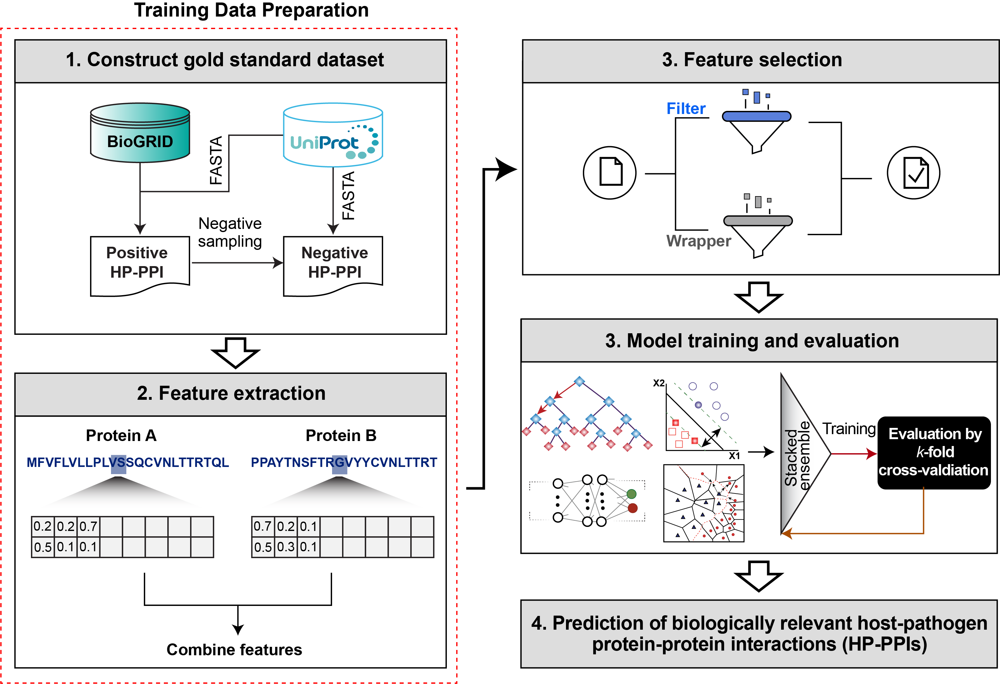
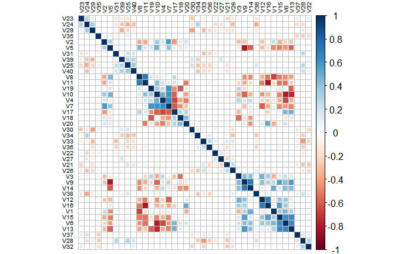
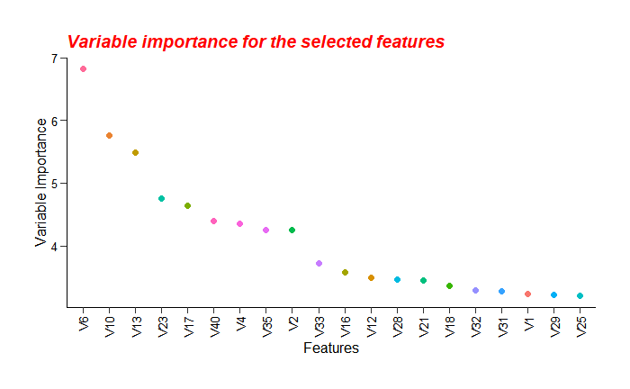
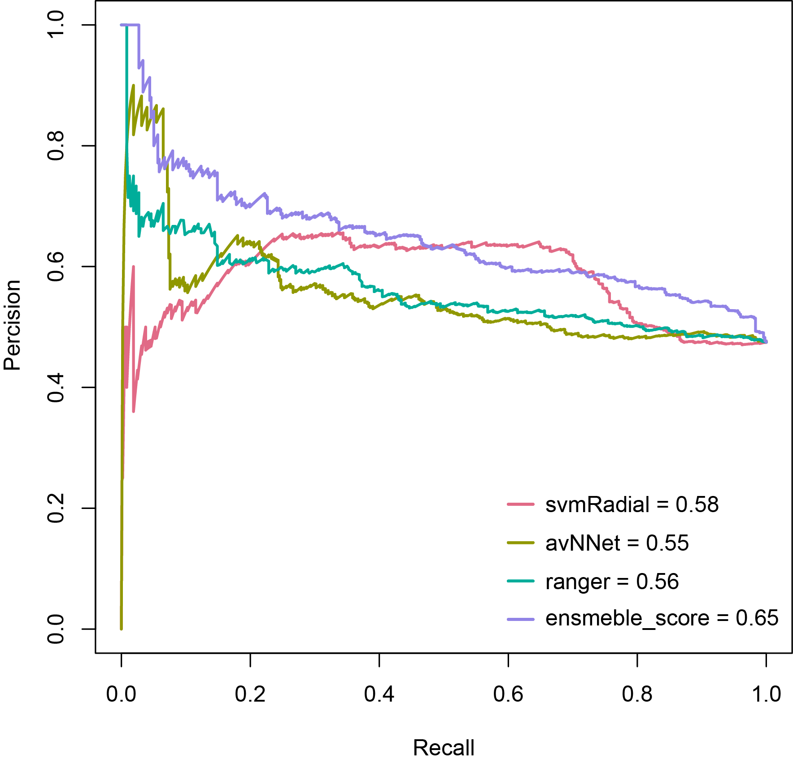
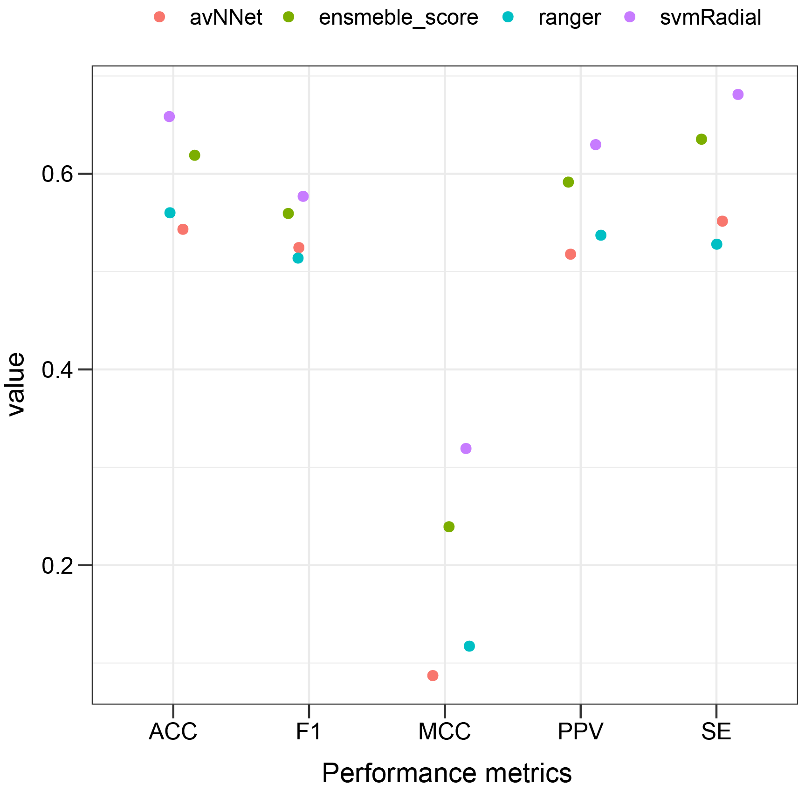
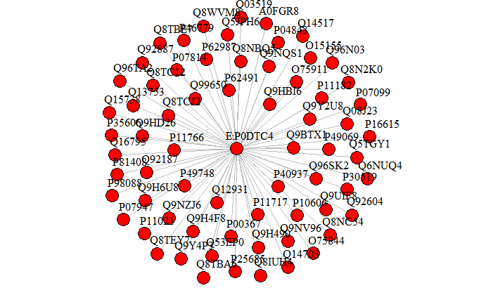
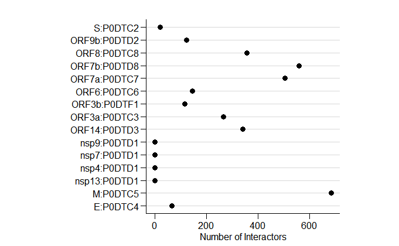
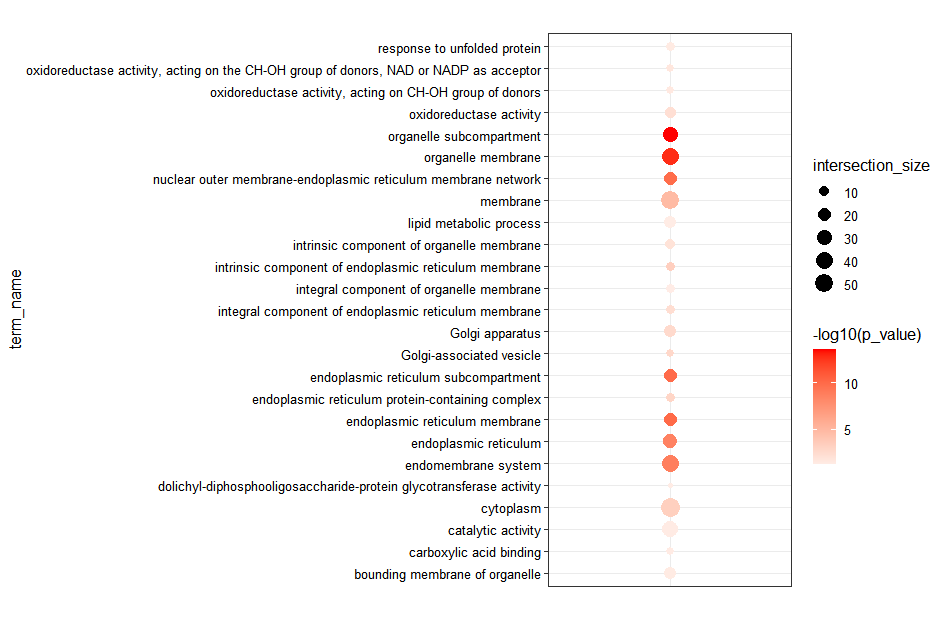

```{r setup, include = FALSE}
knitr::opts_chunk$set(echo = TRUE)
```


```{r, echo=FALSE,message=FALSE, warning=FALSE}
library(dplyr)
library(kableExtra)
library(stringr)
```


## **Introduction**
Infectious disease imposes a significant threat to human health and pose substantial healthcare costs.  Infectious diseases result from the cross-talks between hosts and pathogens, which are mainly mediated by protein-protein interactions between hosts and pathogen proteins (HP-PPIs). The potential (HP-PPIs) represents the crucial elements of the infection mechanism as they decide the outcome, leading to either pathogen clearance or spread of the pathogen in the host due to evading the host immune response [@rahmatbakhsh2021bioinformatic]. Therefore, the study of the host-pathogen interactome is increasingly vital to uncover the molecular attributes of infectious diseases and potentially discover novel pharmacological targets or laying a strong foundation for repurposing of existing drugs.

In the past decades, several high throughput experimental approaches have been developed to chart HP-PPIs on a large scale (e.g., yeast two-hybrid (Y2H) system [@ito2001comprehensive] or affinity purification (AP) coupled to mass spectrometry (MS) [@puig2001tandem]). However, such high-throughput experimental screens are typically laborious, time-consuming, and challenging to capture the complete interactome, resulting in limited number of experimentally validated interactome in a database of HP-PPIs [@hart2006complete]. In-silico prediction of HP-PPIs can complement wet-lab experiments by suggesting candidate interaction partners for all the host proteins and excluding partners with low interacting probability scores to reduce the range of possible PPI candidates that need to be validated via wet-lab experiments. Specialized computational approaches to predict HP-PPIs are therefore of significant importance. While many  computational tools have been developed to predict intra-species PPIs (i.e., PPIs within the same species) [@wu2006prediction; @shen2007predicting; @nourani2015computational], the availability of computational tools to predict inter-species PPIs such as HP-PPIs are rare.

For this purpose, we describe HPiP (host-pathogen interaction prediction), an R package for automated prediction of HP-PPIs using structural and physicochemical descriptors computed from amino acid-composition of host and pathogen proteins. The proposed package can effectively address data shortages and data unavailability for HP-PPI network reconstructions. Moreover, establishing computational frameworks in that regard will reveal mechanistic insights into infectious diseases and suggest potential HP-PPI targets, thus narrowing down the range of possible candidates for subsequent wet-lab experimental validations.


## **Workflow for Predicting Host-Pathogen Protein-Protein Interactions (HP-PPIs)**

The HPiP is an R package that uses an ensemble-based predictive method to predict large-scale interspecies host-pathogen protein-protein interactions (HP-PPIs). The HPiP package calculates a series of structural and physicochemical descriptors from the amino-acids composition of host and pathogen proteins to encode host and pathogen proteins as feature vectors. The HPiP also requires a set of `gold standard` HP-PPIs to learn from. These features and the accompanying gold standard are called labeled training data. The labeled training data is then fed into the hybrid filter-wrapper feature selection method to select features that are most relevant in inferring the target variable. Following the feature selection, the labeled training data is then fed into the ensemble learning model. During training, the model’s hyperparameters are tweaked, and the model will learn the mapping between independent variables (i.e., HPIs feature vector) and class labels assigned to each instance [@rahmatbakhsh2021bioinformatic]. The training model will then be tested on unseen data (i.e., test data) to evaluate the performance of the model algorithm through cross-validation and various metrics (e.g., F-measure) to judge the model’s performance. The model that performs best during cross-validation is considered the optimal model. The final predictive model is then applied on newly presented input data containing new pathogen or host proteins to return a classification result for every potential HP-PPI instance in the dataset corresponding to the support level for that pair of proteins to interact. The user can then apply a threshold of their choice to the output list to infer the protein-protein interaction network for their studies.



  <p align="right"> **Figure 1: Schematic showing steps involved in the prediction algorithm**. Positive and negative sets are generated from public databases such as BioGrid. Structural and physicochemical features are then computed from amino acid-composition of host and pathogen proteins. Sequence-based features can be combined into one vector space to generate host-pathogen protein-protein interaction descriptors. Filter-wrapper feature selection approach can then be applied to select the most important features, and, after hyperparameter optimization of base classifiers, the stacking ensemble approach will be applied to average predictions over an ensemble of base classifiers, each with different cross-validation splits. Finally, through *k*-fold cross-validation and independent tests, this function also compares and evaluates the performance of our ensemble model with individual base classifiers via commonly used measurements (e.g., F2-score). The final predictive model is then used to score HP-PPIs  in newly presented input data. 
  


### **Data Set Construction** 
  
#### **Gold Standard Reference Dataset of Host-Pathogen PPIs**
In this tutorial, we use the dataset provided by @samavarchi2020sars as our benchmark dataset. In this study, the authors mapped interaction between 27 SARS-CoV-2 and host proteins via the proximity-dependent biotinylation (BioID) approach. We then randomly selected 500  SARS-CoV-2-host interaction pairs from all pairs as the positive samples. Since ground truth negatives are not available,here negative examples are generated from the positive set using negative sampling [@eid2016denovo]. In this approach, negative instances are sampled from all the possible pairwise combinations of host and viral proteins, as long as the possible pairs do not occur in the positive reference set. To prevent statistical differences, the same scale is assumed for the negative and positive instances (i.e., the ratio of positive to negative 1:1) [@zhou2018generalized]. The `gold-reference` data set can be loaded with the following command: 
    
```{r}
library(HPiP)
Gold_ReferenceSet <- 
  readRDS(system.file("examples/Gold_ReferenceSet.rds", package="HPiP"))
dim(Gold_ReferenceSet)
```
As stated by `dim()` the gold reference set includes 1000 HP-PPIs interaction between 27 SARS-CoV-2 and 694 host proteins. 
  
In addition, users can use the available functions in the HPiP package to construct `gold reference` data set for the organism of interest from the BioGrid database [@stark2006biogrid]. Creation of `gold reference` set with HPiP is simple as the following commands: 
    
```{r}
#Get positive interactions from BioGrid 
TP <- get_positivePPI(organism.taxID = 2697049)
head(TP)
```
Subsequently, we can construct negative instances via negative sampling:
```{r}
#pathogen proteins
prot1 <- unique(TP$`Official Symbol Interactor A`)
#host proteins
prot2 <- unique(TP$`Official Symbol Interactor B`)
#true positive PPIs 
TPset <- TP$PPI
TN <- get_negativePPI(prot1 , prot2, TPset)
```
#### **FASTA  Sequences Extraction**
To compute different features from protein sequences, we must first extract their sequences (in FASTA format). The `get_FASTA` function in the HPiP package can retrieve the sequences for any organism from the UniProt database by providing the proteome identifier of the respective organism (available at: https://www.uniprot.org/proteomes/) to `proteomeIDs` argument.
```{r}
#get FASTA sequences for three proteins of SARS-Cov-2
x = c("P0DTC4","P0DTC5","P0DTC9")
fasta_df <- get_FASTA(custombg = x,proteomeIDs = "UP000464024")

#get FASTA sequences for all viral proteins
fasta_df <- get_FASTA(custombg = NULL,proteomeIDs = "UP000464024")
```


### **Sequence-based Features Extraction**
To apply a learning algorithm on a host or pathogen protein sequence, it is needed to encode sequence information as numerical features. However, one of the critical challenges in inferring protein-protein interactions from the protein sequences is finding an appropriate way to encode protein sequences' important information fully. Also, the amino-acid sequences of different lengths should be converted to fixed-length feature vectors, which is crucial in classifying training data using machine-learning techniques as such techniques require fixed-length patterns. The HPiP offers multiple functions for generating various numerical features from protein sequences.

These feature coding schemes listed in HPiP include amino acid composition (AAC), dipeptide composition (DC), tripeptide composition (TC), tripeptide composition (TC) from biochemical similarity classes, quadruplets composition (QC), F1, F2, CTD (composition/transition/distribution), conjoint triad, autocorrelation, *k*-spaced amino acid pairs, and binary encoding. 

##### **Amino acid composition (AAC) Descriptor**
The amino acid composition (AAC) has low complexity and has been widely
used to predict protein-protein interactions (PPIs) [@beltran2019predicting; @dey2020machine].The AAC explains the fraction of a type of amino acid found within a protein sequence [@dey2020machine]. This gives 20-dimensional feature vectors. For example, the fraction of all 20 natural amino acids is computed as follow:

\[
f_{(i)}=\frac{n_i}{L} \text{ }\  (i = 1,2,3,....,20)
\]

where *n*~i~ is the number of amino acid type and *L* is the sequence length.The ACC descriptor from the  protein sequences can be loaded with the following command:

```{r}
#extract AAC for SARS-COV-2 viral proteins
x <- readRDS(
system.file("protseq/UP000464024_FASTAList.rds", package = "HPiP"))
x_df <- calculateAAC(x)
#only print out the result for the first row 
x_df <- x_df[1,-1] 

```

```{r, echo= FALSE}
x_df <- structure(as.numeric(x_df), names = colnames(x_df)) 
x_df
```

##### **Dipeptide Composition (DC) Descriptor**
The dipeptide composition (DC) is simply the fraction of the different adjacent pairs of amino acids within a protein sequence [@bhasin2004classification]. Also, this descriptor encapsulates the properties of neighboring amino acids. Dipeptide composition converts a protein sequence to a vector of 400 dimensions. The composition of all 400 natural amino acids can be calculated using the following equation: 

\[
f_{(m,k)}=\frac{n_{m,k}}{L-1} \text{ }\  (m,k = 1,2,3,....,20)
\]

where *n*~m,k~ corresponds to the number of dipeptide compositions characterized by amino acid type *m* and type *k*, while *L* is the sequence length.The DC descriptor from the protein sequences can be loaded with the following command:
```{r}
x_df <- calculateDC(x)
#only print out the first 30 elements for the first row 
x_df <- x_df[1, c(2:31)] 
```

```{r, echo= FALSE}
x_df <- structure(as.numeric(x_df), names = colnames(x_df)) 
x_df
```
##### **Tripeptide Composition (TC) Descriptor**
The tripeptide composition explains the occurrence of adjacent triune residues in a protein sequence [@liao2011predicting]. Tripeptide composition converts a protein sequence to a vector of 8,000 dimensions. The composition of all 8,000-dimensional descriptor can be calculated using the following equation: 
\[
f_{(m,k,j)}=\frac{n_{m,k,j}}{L-2} \text{ }\  (m,k,j = 1,2,3,....,20)
\]
where *n*~m,k,j~ corresponds to the number of tripeptide compositions characterized by amino acid type *m*, *k* and *j*, while *L* is the sequence length.The TC descriptor from the protein sequences can be loaded with the following command:
```{r}
x_df <- calculateTC(x)
#only print out the first 30 elements for the first row 
x_df <- x_df[1, c(2:31)] 
```

```{r, echo= FALSE}
x_df <- structure(as.numeric(x_df), names = colnames(x_df)) 
x_df
```
##### **&nbsp;&nbsp;Tripeptide Composition (TC) from Biochemical Similarity Classes Descriptor**
In order to reduce the dimension of length-8,000 TC descriptor, the sequence alphabet is reduced from 20 amino acids to six classes based on biochemical similarity. The classes are [{IVLM}, {FYW}, {HKR}, {DE}, {QNTP}, and {ACGS} [@ahmed2018prediction]]. This classification of amino acids  converts a protein sequence to a vector of 216 (i.e., 6 * 6 * 6) different combinations of possible substrings of length 3. The frequency of triplet for each encoded class in the protein sequence can be calculated as follows:

\[
q_{(i)}=\frac{f_i - M_0}{M_1-M_0}
\]
\[
M_0 = min(f_1,f_2,...,f_{216})\text { and}\ M_1 = max(f_1,f_2,...,f_{216})
\]

Here *f*~i~ is the frequency of *i*^th^ triplet in the sequence *i*=1,2,...,216. To get 216-dimensional descriptor from the protein sequences, the following command can be used:

```{r}
x_df <- calculateTC_Sm(x)
#only print out the first 30 elements for the first row 
x_df <- x_df[1, c(2:31)] 

```

```{r, echo= FALSE}
#convert df to character vector 
x_df <- structure(as.numeric(x_df), names = colnames(x_df)) 
x_df
```
##### **&nbsp;&nbsp;Quadruplets Composition from Biochemical Similarity Classes Descriptor**

To compute these features, the sequence alphabet is first reduced to six classes reported above (section `0.2.2.0.4`). This reduction converts a protein sequence to a vector of 1296 (i.e., 6 * 6 * 6 * 6) different combinations of possible substrings of length 4 [@ahmed2018prediction]. The frequency of quadruplets for each encoded class in the protein sequence can be calculated similarly to the equation mentioned above:
  
\[
q_{(i)}=\frac{f_i - M_0}{M_1-M_0}
\]
\[
M_0 = min(f_1,f_2,...,f_{1296})\text { and}\ M_1 = max(f_1,f_2,...,f_{1296})
\]
To get 1296-dimensional descriptor from the protein sequences, the following command can be used:
```{r}
x_df <- calculateQD_Sm(x)
#only print out the first 30 elements for the first row 
x_df <- x_df[1, c(2:31)] 
```

```{r, echo= FALSE}
x_df <- structure(as.numeric(x_df), names = colnames(x_df)) 
x_df
```


##### **F1 Composition Descriptor**
F1 composition gives 20-dimensional description, defined as: 
  
\[
F1(SAR)=\sum_{SAR\text{ }\epsilon\text{ } sequence}length(SAR)^2 
\]

Where *SAR* is the sum of squared length of single amino acid repeats (SARs) in the entire protein sequence. Since F1 includes SAR of length 1, the F1 descriptor reveals global composition of amino acids and amino acid repeats [@alguwaizani2018predicting]. 


  <p align="right"> **Figure 2: Example of calculating F1 (repeats of S) in the protein sequence.** 

To get feature F1 from the protein sequences, the following command can be used:
```{r}
x_df <- calculateF1(x)
#only print out the result the first row 
x_df <- x_df[1,-1] 
```

```{r, echo= FALSE}
#convert df to character vector 
x_df <- structure(as.numeric(x_df), names = colnames(x_df)) 
x_df
```
##### **F2 Composition Descriptor**
To calculate feature F2, the sequence alphabet is first split into substrings of length 6 residues [@alguwaizani2018predicting]. There are two main differences between feature F2 and F1: 
  
- For F2, sum of square length of single amino acid repeats (SARS) is computed for every window of 6 residues. 
- The maximum  of the sum of squared length of SARs is selected for F2.

F2 composition gives 20-dimensional description, defined as: 
  
\[
F1(SAR)=max_{windows\text{ }\epsilon\text{ }sequence} \sum_{SAR\text{ }\epsilon\text{ } sequence}length(SAR)^2 
\]

Where SAR is the sum of squared length of single amino acid repeats (SARs) in the entire protein sequence.

To get feature F2 from the protein sequences, the following command can be used:
```{r}
x_df <- calculateF2(x)
#only print out the result for the first row 
x_df <- x_df[1, -1] 
```

```{r, echo= FALSE}
#convert df to character vector 
x_df <- structure(as.numeric(x_df), names = colnames(x_df)) 
x_df
```

##### **Composition/Transition/Distribution (CTD) Descriptors**
To calculate CTD descriptors developed by [@dubchak1995prediction; @dubchak1999recognition], the 20 standard amino acids is first clustered into three classes according to its attribute. Then, each amino acid in the protein sequence is encoded by one of the indices 1,2,3 depending on its grouping.  The corresponding divisions for each group are shown in **Table 1**. According to Hydrophobicity grouping mentioned in **Table 1**, the protein sequence `CLVIMFWGASTPHYRKEDQN` is replaced by `1111112222222333333`. Next, for a given attribute, three types of descriptors, composition (C), transition (T), and distribution (D) can be calculated, which will be explained in the following sections.

```{r, echo=FALSE}
table <- read.csv(
  system.file("tables/ctd.csv", package = "HPiP"))
table[is.na(table)] <- ""
table %>%
  kbl(caption = "Amino acid attributes and the division of amino acid into three-group") %>%
  kable_classic(full_width = FALSE, html_font = "Cambria")
```

###### **Composition (C) Descriptor**
The composition represents the number of amino acids of a particular property (e.g., hydrophobicity)  for each encoded class divided by the protein sequence length [@you2014prediction]. In the above example using the hydrophobicity attribute, the number for encoded classes `1`, `2`, `3` are 7,7,6 respectively. Therefore, the compositions for each class are **7/20 =35%**, **7/20 =35%**, and **6/20 =30%**, respectively. Composition descriptor can be defined as:
  
\[
C_{(i)}=\frac{n_i}{L} \text{ }\  (i = 1,2,3)
\]

where *n*~i~ is the number of amino acid type i and *L* is the sequence length.The C descriptor from the  protein sequences can be loaded with the following command:
  
  
```{r}
x_df <- calculateCTDC(x)
#only print out the result for the first row 
x_df <- x_df[1, c(-1)] 

```

```{r, echo= FALSE}
x_df <- structure(as.numeric(x_df), names = colnames(x_df)) 
x_df
```


###### **Transition (T) Descriptor**
Transition (T) characterizes the percent frequency from a type of amino acids to another type (Wang et al., 2017). For instance, a transition from class `1` to `2`  or `2` to `1` is the percent frequency with which class `1` is followed by class `2` or vice versa [@xiao2015protr]. The frequency of these transitions can be computed as follow: 
  
\[
T_{(rs)}=\frac{n_{rs} + n_{sr}}{L-1} \text{ }\  (rs = 12,13,23)
\]

where *n*~rs~,*n*~sr~ are the number of dipeptide encoded as `rs` and `sr` in the sequence and and *L* is the sequence length.The T descriptor from the  protein sequences can be calculated with the following command:
  
  
```{r}
x_df <- calculateCTDT(x)
#only print out the result for the first row 
x_df <- x_df[1, -1] 

```

```{r, echo= FALSE}
x_df <- structure(as.numeric(x_df), names = colnames(x_df)) 
x_df
```
###### **Distribution (D) Descriptor**
The distribution measures the chain length within which the first, 25%, 50%, 75%, and 100% of the amino acids of a particular property (e.g., hydrophobicity) for a certain encoded class are located, respectively [@dubchak1995prediction]. For example, as shown in **Figure 3**,  there are 8 residues as `1`, the position for the first residue `1` , the 2nd residue `1` (25% * 8 = 2), the 5th `1`  residue (50% * 8 = 4), the 7th `1` (75% * 8= 6) and the 10th residue `2` (100% * 8 =8) in the encoded sequence are 1, 2, 13, 17, 22 respectively, so that the distribution descriptors for residue `1`  are : (1/22) ×100% = 4.55%, (2/22) ×100% = 9.09%, (13/22) ×100% = 59.09%, (17/22) ×100% = 77.27%, (22/22)×100% = 100%, respectively. Likewise, the distribution descriptor for `2` and `3` is (18.18%, 18.18%, 27.27%, 63.64%, 95.45%) and (13.64%, 31.82%, 45.45%, 54.55%, 86.36%), respectively.


  <p align="left">**Figure 3:The sequence of hypothetical protein showing the construction of CTD descriptors of a protein**. The index 1, 2 and 3 indicates the position of amino acid for each encoded class. 1-2 transitions indicated the position of `12` or `21` pairs in the sequence. Similarly, 1-3 and 2-3 transitions are defined in the same way.
  
The D descriptor from the  protein sequences can be calculated with the following command:
```{r, warning=FALSE}
x_df <- calculateCTDD(x)
#only print out the first 30 elements for the first row 
x_df <- x_df[1, c(2:31)] 
```
    
```{r, echo= FALSE}
x_df <- structure(as.numeric(x_df), names = colnames(x_df)) 
x_df
```  
  
  
##### **Conjoint Triad Descriptor**
The conjoint triad is one of the popular sequence-based approaches for protein-protein interactions prediction [@shen2007predicting]. This method encodes a protein sequence as a feature vector by calculating the frequency of amino acid triplets as follows (Figure 2) :
  
  
- Similar to `section 2.2.0.3`, it encodes 20 amino acids to seven classes based on their dipoles and volumes of the side chains. These seven classes are [{AGV}, {DE}, {FILP}, {KR}, {MSTY}, and {C} (Shen et al., 2007)]


- A given protein sequence is then represented using three consecutive amino acids (i.e., amino acid triple).


- It uses 343-dimensional feature vectors to represent a given protein sequence, where  then each feature vector *v* is then mapped to frequency vector *d*~i~ (i= 1,2,…343), which is defined as follow:  
  
  
\[
d_i = \frac{f_i - \min\{\,f_1, f_2 , \ldots, f_{343}\,\}}{\max\{\,f_1, f_2, \ldots, f_{343}\,\}}
\]

Where *f*~i~ is the frequency of *i*-th triplet type in the protein sequence. The numerical value of *d*~i~ of each protein ranges between 0 to 1, which therefore allows the comparison between proteins. 


  <p align="left">**Figure 4: Schematic diagram for constructing conjoint triad method**. V is the vector space of feature vectors that includes a fixed number of features; each feature (v~i~) includes amino acid triplet; F represents the frequency vector corresponding to V, and the value of *i*-th dimension of F(*f*~i~) corresponds to the frequency of that *v*~i~-triad observed in the sequence.


The conjoint triad Descriptor descriptor from the  protein sequences can be calculated with the following command:
  
  
```{r, warning=FALSE}
x_df <- calculateCTriad(x)
#only print out the first 30 elements for the first row 
x_df <- x_df[1, c(2:31)] 

```

```{r, echo= FALSE}
#convert df to character vector 
x_df <- structure(as.numeric(x_df), names = colnames(x_df)) 
x_df
```

#####	  **&nbsp;&nbsp;Autocorrelation (Auto) descriptors**
Autocorrelation descriptors, also known as molecular connectivity indices, explain the magnitude of the correlation between protein or peptide sequences based on their particular structural or physiochemical information, which are defined according to the distribution of amino acid properties along the protein sequence [@ong2007efficacy]. Eight default properties [@xiao2015protr] are used here for deriving the autocorrelation descriptors: normalized average hydrophobicity scales (AccNo. CIDH920105), average flexibility indices (AccNo. BHAR88010), polarizability parameter (AccNo. CHAM820101), free energy of solution in water(AccNo. CHAM820102), residue accessible surface area in tripeptide (AccNo. CHOC760101), residue volume (AccNo. BIGC670101), steric parameter (AccNo. CHAM810101), and relative mutability (AccNo. DAYM780201). 
Autocorrelation descriptors includes three types of descriptors (Morean-Broto, Moran, and Geary) which are described below. Prior to integrating any of the physiochemical attributes into the autocorrelation formula, these attributes need to be normalized by the following equation:
  
  
\[
P_r = \frac{P_r - \bar{P}}{\sigma}
\]
where $\bar{P}$ is the mean value of the eight physiochemical attributes, and sigma represents the standard deviation, in which both can be defined as: 
  
\[
\bar{P} = \frac{\sum_{r=1}^{20} P_r}{20} \quad \textrm{and} \quad \sigma = \sqrt{\frac{1}{2} \sum_{r=1}^{20} (P_r - \bar{P})^2}
\]

The first type of autocorrelation is known as Moreau-Broto autocorrelation [@broto1984molecular]. Application  of Moreau-Broto autocorrelation to protein sequence is calculated by the following equation:  
  
\[
AC(d) = \sum_{i=1}^{L-d} P_i P_{i + d} \quad d = 1, 2, \ldots, \textrm{nlag}
\]

where $P_i$ and $P_{i+d}$ represent the amino acid property at position $i$ and $i+d$ and $d$ is termed the lag of the autocorrelation along the protein sequence; 
$P_i$ and $P_{i+d}$. While, $\textrm{nlag}$ is the maximum value of the lag. This equation can be normalized based on peptide length to get normalized Moreau-Broto autocorrelation: 
  
\[
ATS(d) = \frac{AC(d)}{L-d} \quad d = 1, 2, \ldots, \textrm{nlag}
\]

The second type of autocorrelation, named the Moran autocorrelation (Moran, 1950), can be defined as:
  
\[
I(d) = \frac{\frac{1}{L-d} \sum_{i=1}^{L-d} (P_i - \bar{P}') (P_{i+d} - \bar{P}')}{\frac{1}{L} \sum_{i=1}^{L} (P_i - \bar{P}')^2} \quad d = 1, 2, \ldots, 30
\]

where $d$, $P_i$, and $P_{i+d}$ are described in the same fashion as that for Moreau-Broto autocorrelation; $\bar{P}'$ is the mean of the given amino acid property $P$ across the protein sequence, i.e.,
                                                              
\]
\bar{P}' = \frac{\sum_{i=1}^L P_i}{L}
\]                                                                                    

$d$, $P$, $P_i$ and $P_{i+d}$, $\textrm{nlag}$ are defined as above. The main difference between Moran and Moreau-Broto autocorrelation is that, unlike Moreau-Broto, the Moran autocorrelation utilizes the mean value of the given amino acid property instead of the actual value of the property [@al2019rf]. 

The last type of autocorrelation , known as the Geary autocorrelation, can be calculated as: 
  \[
C(d) = \frac{\frac{1}{2(L-d)} \sum_{i=1}^{L-d} (P_i - P_{i+d})^2}{\frac{1}{L-1} \sum_{i=1}^{L} (P_i - \bar{P}')^2} \quad d = 1, 2, \ldots, 30
    \]
    
where $d$, $P$, $P_i$, $P_{i+d}$, and $\textrm{nlag}$ are defined above. The key difference between Geary  and the other two autocorrelations is that the Geary
autocorrelation utilizes the square difference of the property values [@al2019rf]. 
    
    
Computing autocorrelation with HPiP is simple as the following commands: 
      
- **Get Moran autocorrelation:**
```{r, warning=FALSE}
    x_df <- calculateMoran(x, nlag  = 10)
    #only print out the first 30 elements for the first row 
    x_df <- x_df[1, c(2:31)] 
```
    
```{r, echo= FALSE}
    #convert df to character vector 
    x_df <- structure(as.numeric(x_df), names = colnames(x_df)) 
    x_df
```
- **Get Normalized Moreau-Broto autocorrelation:**
```{r, warning=FALSE}
x_df <- calculateMoreauBroto(x, nlag  = 10)
#only print out the first 30 elements for the first row 
x_df <- x_df[1, c(2:31)] 
    
```
    
```{r, echo= FALSE}
#convert df to character vector 
x_df <- structure(as.numeric(x_df), names = colnames(x_df)) 
x_df
```
    
- **Get Geary autocorrelation:**
```{r, warning=FALSE}
x_df <- calculateGeary(x, nlag  = 10)
#only print out the first 30 elements for the first row 
x_df <- x_df[1, c(2:31)] 
```
    
```{r, echo= FALSE}
#convert df to character vector 
x_df <- structure(as.numeric(x_df), names = colnames(x_df)) 
x_df
```
    
    
    
#####	  **&nbsp; &nbsp;k-Spaced Amino Acid Pairs**
The k-spaced amino acid pairs (KSAAP) feature describes the number of occurrences of all possible amino acid pairs by a distance of k, which can be any number of residues up to two less than the protein length [@al2019rf]. For instance, given 400 (20 x 20) amino acid pairs and four values for k (k = 1-4), there would be 1600 attributes resulted from the KSAAP feature, and the frequency of each amino acid pair with k spaces is calculated by sliding through protein sequence one by once. Table 2 illustrates the outputs of using KSAAP features with various values of k for protein sequence `ARAQRTAAADARAKAAKAGCAARRAAATANYN`.  


    
```{r, echo=FALSE}
    
table <- read.csv(
  system.file("tables/KSAAP_table.csv", package = "HPiP"))
table[is.na(table)] <- ""
table %>%
  kbl(caption = "Composition of k-spaced amino acid pairs.Given 400 (20 × 20) amino acid pairs and four values for k (k = 1–4), there are 1600 attributes generated for the KSAAP feature.",col.names = NULL) %>%
  kable_classic(full_width = FALSE, html_font = "Cambria",position = "left")%>%
  kable_styling(fixed_thead = TRUE)
```
The KSAAP descriptor from the  protein sequences can be calculated with the following command:
```{r, warning=FALSE}
x_df <- calculateKSAAP(x)
#only print out the first 30 elements for the first row 
x_df <- x_df[1, c(2:31)] 
```
    
```{r, echo= FALSE}
#convert df to character vector 
x_df <- structure(as.numeric(x_df), names = colnames(x_df)) 
x_df
```
    
    
#####	  **&nbsp; &nbsp;Binary encoding**
Binary encoding (BE) can be used to transform each residue in a protein sequence into 20 coding values [@al2019rf]. For example, ALa is described as (10000000000000000000) while Cys is defined as (01000000000000000000), etc. Thus, the total length of this feature is 400(20 * 20) vectors.
```{r, warning=FALSE}
x_df <- calculateBE(x)
#only print out the first 30 elements for the first row 
x_df <- x_df[1, c(2:31)] 
    
```
    
```{r, echo= FALSE}
#convert df to character vector 
x_df <- structure(as.numeric(x_df), names = colnames(x_df)) 
x_df
```
    
#### **Summary of descriptors in the HPiP package**
    
```{r, echo=FALSE}
    
table <- read.csv(
  system.file("tables/features_function.csv", package = "HPiP"))
table[is.na(table)] <- ""
table %>%
      kbl(caption = "List of commonly used descriptors in HPiP") %>%
      kable_classic(full_width = FALSE, html_font = "Cambria")
    
```
- ***Note that we can calculate protein sequence descriptors for the host proteins using the functions described above***.
    

    

### **Combine Host-Pathogen Interaction Descriptors**
To generate host-pathogen protein-protein interaction descriptors, sequence-based descriptors can be combined into one vector space using `getHPI()`, which provides two types of interactions, controlled by argument `type`. 
    
As an example, we will compute Amino Acid Composition (ACC) descriptor for host and pathogen proteins present in the `Gold_ReferenceSet.csv` data set. 
    
**1. Load the gold-standard data:**
      
```{r}
#Load the gold-standard data
gd <- readRDS(
  system.file("examples/Gold_ReferenceSet.rds", package = "HPiP"))
```
**2. Retrieve the protein sequences for both host and pathogen proteins (also described in section `2.1.2`):**
```{r, eval = FALSE}
viralid <- unique(gd$Pathogen_Protein)
viralidseq <-get_FASTA(custombg = viralid, "UP000464024")
viralidseq <- viralidseq[order(match(viralidseq$UniprotKBID,viralid)),]
```
    
```{r, eval = FALSE}
hostid <- unique(gd$Host_Protein)
hostseq <-get_FASTA(custombg = hostid, "UP000005640")
hostseq <- hostseq[order(match(hostseq$UniprotKBID,hostid)),]
```
**3.Calculate amino acid composition (AAC) descriptor (also described in section `2.2.0.1`):**
```{r, eval = FALSE}
x_viral <- calculateAAC(viralidseq)
x_viral1 <- as.matrix(x_viral[, -1])
row.names(x_viral1) <- x_viral$identifier
    
x_host <- calculateAAC(hostseq)
x_host1 <- as.matrix(x_host[, -1])
row.names(x_host1) <- x_host$identifier
```
**4.Map the amino acid composition (AAC) descriptor to the gold-standard data:**
```{r, eval = FALSE}
x1_viral <- matrix(NA, nrow = nrow(gd), ncol = ncol(x_viral1))
for (i in 1:nrow(gd)) x1_viral[i, ] <- x_viral1[which(gd$Pathogen_Protein[i] == viralid), ]
    
x1_host <- matrix(NA, nrow = nrow(gd), ncol = ncol(x_host1))
for (i in 1:nrow(gd)) x1_host[i, ] <- x_host1[which(gd$Host_Protein[i] == hostid), ]
```
**5.Generate host-pathogen interaction descriptors using `getHPI`:**
```{r, eval = FALSE}
x <- getHPI(x1_viral,x1_host, type = "combine")
x <- as.data.frame(x)
x <- cbind(gd$PPI, gd$class, x)
colnames(x)[1:2] <- c("PPI", "class")
```

### **Data Preparation**
It is crucial to pre-process the data (i.e., remove the noise) before feeding it into the machine learning model as the quality of data and valuable information that can be extracted from it directly affect the model's performance. The pre-processing steps are as follow:

- ***Handling missing values***: in any real-world data set, there are always missing values. The easiest option is to remove rows or columns including missing values; however, such an approach results in losing valuable information. The alternative method is to impute missing values using neighboring information (e.g., average or median) or replace the missing values with zeros. HPiP package provides two functions to deal with the missing values. The `filter_missing_values` allows the user to drop the missing values above a certain threshold, controlled by argument `max_miss_rate`, while the `impute_missing_data` function replaces the null values with mean/median or zero, controlled by argument `method`. 

- ***Feature selection***: some of the sequence-based features are high dimensional, including hundreds to thousands of features. Unfortunately, such high-dimensional data includes many redundant features that reduce the predictive model's accuracy and increase the training time. The `FSmethod`function in the HPiP package combines two feature selection (FS) methods, controlled by `type()` argument, to eliminate redundant features. The first FS method is based on correlation analysis that computes the correlation between features using Pearson correlation measure and removes highly correlated features below the user-defined threshold. The second FS method uses the Recursive Feature Elimination (RFE) algorithm  (wrapped up with a random forest (rf) machine learning algorithm) to perform feature selection. RFE works by fitting the *rf* algorithm with all features in the training data set, ranking features by importance, removing the least important features, and re-fitting the model until the desired number of features remains. The feature importance can be computed using *rf* model-independent metric (e.g.,  ROC curve analysis or accuracy), which is controlled by argument `metric()`. 
    
The complete set of arguments for `FSmethod` function are:
      
- `x` A data.frame containing protein-protein interactions, class labels and features.
- `type` The feature selection type 
- `cor.cutoff` Correlation coefficient cutoff used for filtering.
- `resampling.method` The re-sampling method for RFE.
- `iter` Number of partitions for cross-validation.
- `repeats` For repeated *k*-fold cross validation only.
- `metric`  A string that specifies what summary metric will be used to select the optimal feature.
- `verbose` Make the output verbose.
    
Continuing our example from section **2.3**, feature selection using both correlation analysis and RFE approach can be performed using the following command: 
      
```{r,message=FALSE, eval = FALSE}
#to use correlation analysis, make sure to drop the columns with sd zero
xx <- Filter(function(x) sd(x) != 0, x[,-c(1,2)])
xx <- cbind(x$PPI, x$class, xx)
colnames(xx)[1:2] <- c("PPI", "class")

#perform feature selection using both correlation analysis and RFE approach
set.seed(101)
x_FS <- FSmethod(xx, type = c("both"),
                     cor.cutoff = 0.8,resampling.method = "cv",
                     iter = 5,repeats =NULL, metric = "Accuracy", verbose = FALSE)
```
We can also visualize the results from the `FSmethod` analysis. For instance, the correlation matrix of unfiltered data can be visualized using the `corr_plot`. This will present us with a heatmap showing the correlation between all the features prior to filtration.  
```{r,results='hide', message=FALSE, eval = FALSE, fig.show="hide"}
#cor plot
corr_plot(x_FS$cor.result$corProfile, method = 'square' , cex = 0.6)
```

      <p align="left"> **Figure 5: Correlation plot.**
    
In addition, the variable importance of retained features after the RFE feature selection approach can also be plotted using the `var_imp` function. 
```{r, results='hide', message=FALSE, eval = FALSE, fig.show="hide"}
#var importance
var_imp(x_FS$rf.result$rfProfile, cex.x = 10, cex.y = 10)
```

<p align="right"> **Figure 6: Variable importance plot.**
    


### **Predict Interaction via Ensemble learning method**
Sequence features and a list of gold-standard HP-PPIs can be fed into an ensemble classifier to rank the potential HP-PPIs interaction. This is accomplished via the `pred_ensmebel` function. This function uses the stacking approach, also called stacked generalization  [@emamjomeh2014predicting], to combine any base classifiers provided in the `caret` package to predict HP-PPIs. 
To score interactions, the `pred_ensmebel` function uses the the training data (i.e., labelled HP-PPIs with sequence features) and unlabeled HP-PPIs data set to learn features that allow reliable prediction of HP-PPIs, utilizing multiple ML algorithms. Following training, the trained models will be used to make predictions on unlabeled data. Then, the stacking approach will be applied to average predictions over an ensemble of classifiers, each with different cross-validation splits. Finally, through *k*-fold cross-validation and independent tests, this function also compares and evaluates the performance of our ensemble model with individual ML algorithms via commonly used measurements such as Recall (Sensitivity), Specificity, Accuracy , Precision, F1-score, and Matthews correlation coefficient (MCC). The corresponding formulae are as follows: 
      
\[
Recall=Sensitivity=TPR=\frac{TP}{TP+FN}
\]
    
\[
Specificity=1-FPR=\frac{TN}{TN+FP}
\]
    
\[
Accuracy=\frac{TP+TN}{TP+TN+FP+FN}
\]
    
\[
Precision=\frac{TP}{TP+FP}
\]
    
    
\[
F1=2 \text{ × } \frac{Precision \text{ × } Recall}{Precision + Recall}
\]
    
\[
MCC=\frac{TP \text{ × } TN - FP  \text{ × } FN}{\sqrt{(TP+FP)\text{ × } (TP+FN)\text{ × } (TN+FP)\text{ × } (TN+FN)}}
\]
    
    
    
This function takes the following parameters: 
      
- `features` A data frame with host-pathogen protein-protein interactions (HP-PPIs) in the first column, and features to be passed to the classifier in the remaining columns. 
- `gold_standard` A data frame with gold_standard HP-PPIs and class label indicating if such PPIs are positive or negative.
- `classifier` The type of classifier to use. See `caret` package for all the available classifiers. 
- `resampling.method` The re-sampling method; defaults to cv (i.e., *k*-fold cross-validation).
- `ncross`  Number of partitions for cross-validation.
- `plots` Logical value, indicating whether to plot the performance of ensemble learning algorithm as compared to individual classifiers; defaults to TRUE.
- `verboseIter` Make the output verbose.
    
Contributing our example from section **2.4**, we will demonstrate the use of three base learners, support vector machine (`svmRadial`), neural networks using model averaging (`avNNET`), and random forest (`ranger`), controlled by argument `classifier` to rank potential interaction. For the sake of time, we use only two-fold cross-validation (`ncross = 2`). 
In order to perform prediction, we use the `IndependentData_withFeatures.rds` that includes labelled and unlabeled HP-PPIs along with ACC features and `Gold_ReferenceSet.csv`. We then only select those features in `IndependentData_withFeatures.rds` that deemed important after the feature selection procedure (section **2.4**).
    
```{r, eval = FALSE}
#load the independent data set 
ind_data <- readRDS(
      system.file("examples/IndependentData_withFeatures.rds", package = "HPiP"))
#select important features
ind_data <- ind_data[names(ind_data) %in% names(x_FS$rf.result$rfdf)]
```
    
```{r, eval = FALSE}
#load the gold-standard data set 
gd <- readRDS(system.file("examples/Gold_ReferenceSet.rds", package = "HPiP"))
#select PPI and class label
gd <- gd[c(1,5)]
```
Now we can predict interactions using `pred_ensembel`:
```{r, warning=FALSE,results='hide', message=FALSE, fig.show="hide", eval = FALSE}
ppi <- pred_ensembel(ind_data,
                         gd,
                         classifier = c("svmRadial", "avNNet", "ranger"),
                         resampling.method = "cv",
                         ncross = 5,
                         verboseIter = FALSE,
                         plots = TRUE)
```
To retrieve predicted interactions from the result generated by `pred_ensembel` function, we can just type:
```{r, eval = FALSE}
pred_interactions <- ppi[["predicted_interactions"]]
```
Finally, users can subset their list of high-confidence interactions for further analysis, using a relaxed classifier confidence score cutoff of 60%.
```{r, eval = FALSE}
pred_interactions <- filter(pred_interactions, ensemble_score > 0.6)
dim(pred_interactions)
```
when the `plots` argument set to TRUE, the `pred_ensembel` function generates three plots, that show the performance of the ensemble classifier as compared to individual base learners. 
    
- The first plot shows the Precision-Recall (PR) curve 

      <p align="right"> **Figure 7: Precision-Recall (PR) curve.**
    
- The second plot shows the accuracy (ACC), F1-score ,positive predictive value (PPV),sensitivity (SE),and Matthews correlation coefficient (MCC) of ensemble classifier vs selected individual classifiers.

      <p align="right"> **Figure 8: Point plot.**
    
- The third plot shows the Receiver Operating Characteristic (ROC) curve.

      <p align="right"> **Figure 9: ROC_Curve curve.**
    
    
#### **Results of the prediction**
Following PPI prediction, users can visualize the predicted PPI network using `plotPPI` and `FreqInteractors` functions.
    
- The `plotPPI` function, which is based on the *igraph* plotting function [@csardi2013package], provide visualization on interacting host protein partners of pathogen proteins. For instance, to get the PPI network of SARS-CoV2-E-human, we can run the following command:
      
```{r, fig.show="hide",message=FALSE, warning=FALSE, eval = FALSE}
S_interc <- filter(pred_interactions, 
                           str_detect(Pathogen_protein, "^E:"))
#drop the first column
ppi <- S_interc[,-1]
ppi$ensemble_score <- as.numeric(ppi$ensemble_score)
    
plotPPI(ppi, edge.name = "ensemble_score",
            node.color ="red",
            edge.color = "grey",
            cex.node = 10,
            node.label.dist= 2)
```

      <p align="right"> **Figure 10: SARS-CoV2-E-human PPI network.**
    
    
- The `FreqInteractors` function, shows the degree distribution of pathogen proteins in the HP-PPI network:
      
```{r, fig.show="hide", eval = FALSE}
ppi <- pred_interactions[,-1]
FreqInteractors(ppi,cex.size = 12)
```

<p align="right"> **Figure 11:SARS-CoV-2 proteins' frequency of interactions with human proteins.**


#### **GO Enrichment Analysis**
To identify significantly enriched annotation terms in predicted interacting host protein partners of each pathogen protein, we can use the `enrichfindP` function based on the *g:Profiler* tool [@kolberg2020gprofiler2]. The following command performs functional enrichment analysis:

```{r, eval = FALSE}
enrich_result <- 
  enrichfindP(ppi,threshold = 0.05,
            sources = "GO",
            p.corrction.method = "bonferroni",
            org = "hsapiens")
```
Users can also visualize the result of functional enrichment analysis using the following command:
```{r, fig.show="hide", eval = FALSE}
enrich_result <- filter(enrich_result, 
                       str_detect(id, "^E:"))
enrichplot(enrich_result,
           low = "blue",
           high = "red",
           cex.size = 12)
```

  <p align="right"> **Figure 12: Functional enrichment analysis on interacting human protein partners of SARS-CoV2-E protein.** 


    
## **Session info**

```{r}
sessionInfo()
```

## **References**
