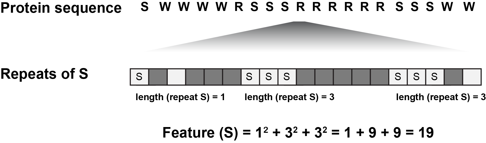
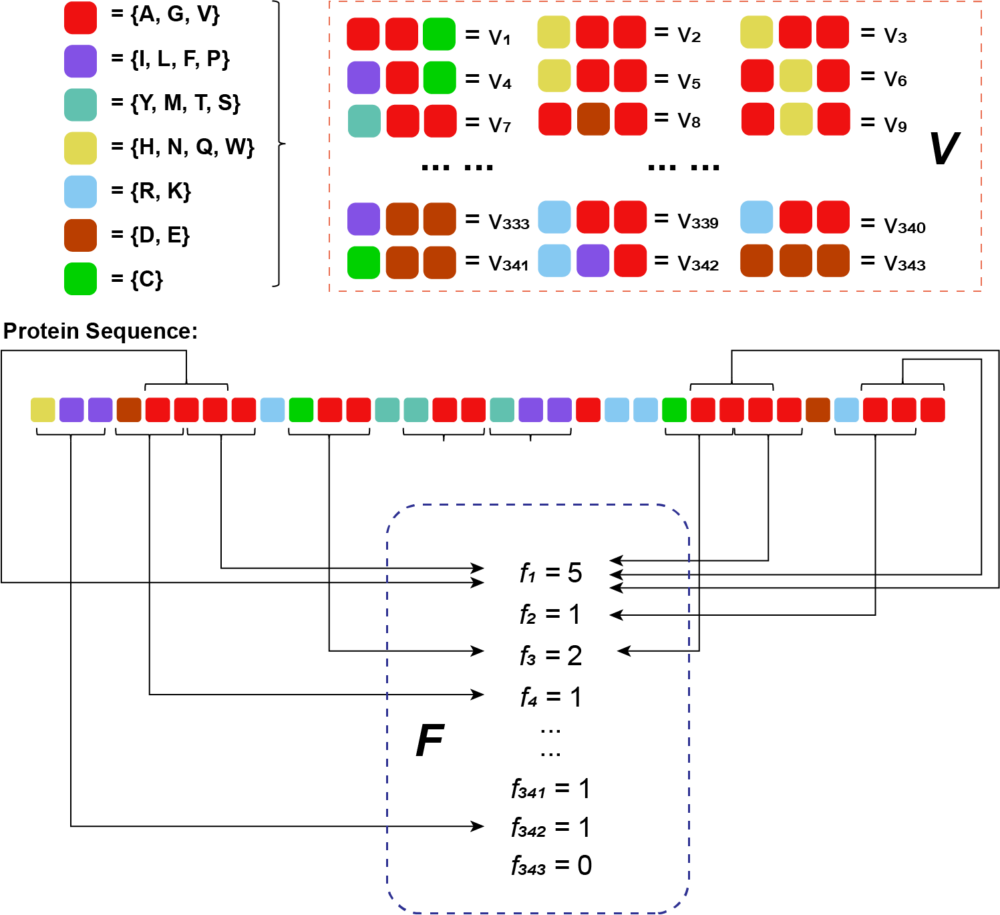
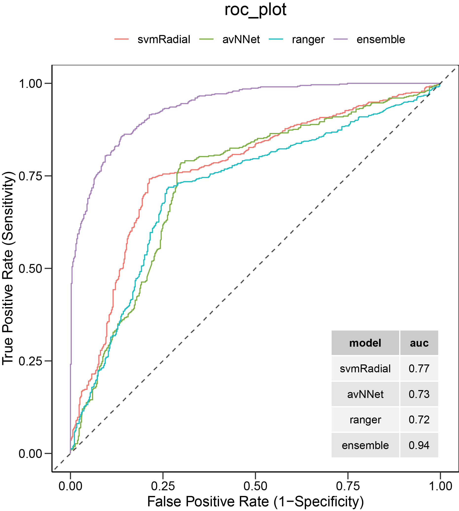
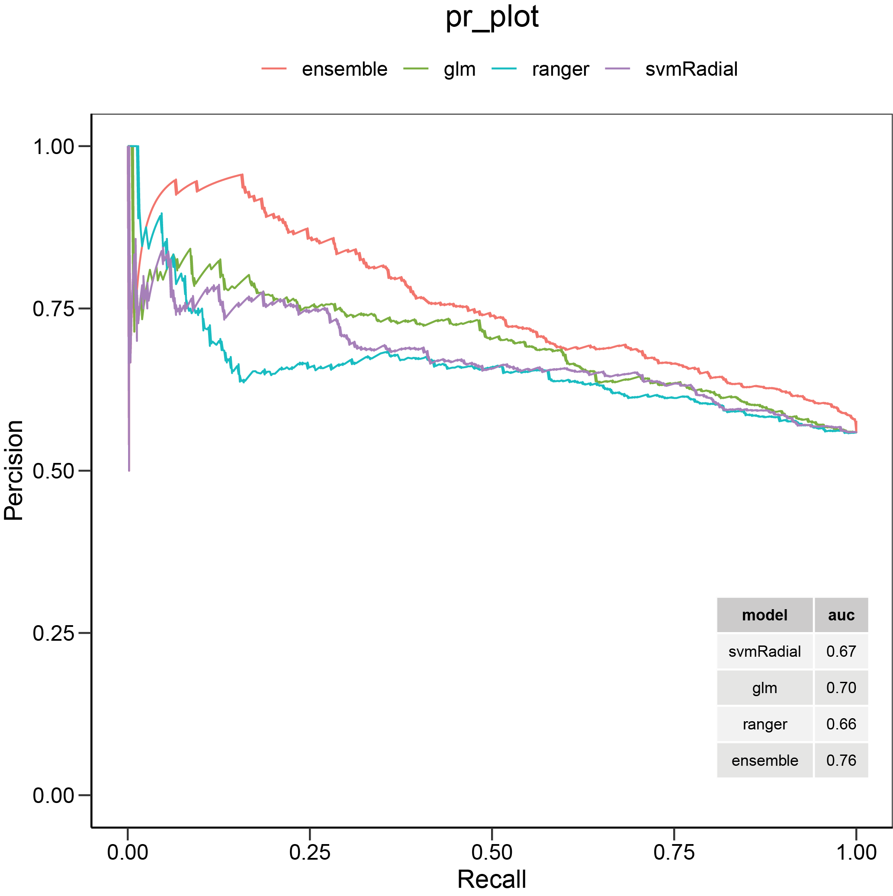
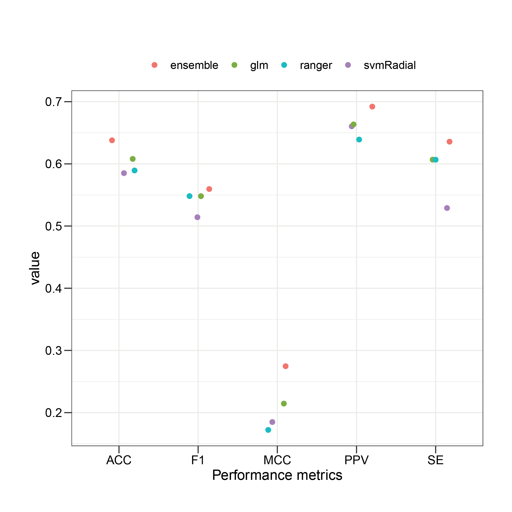

```{r echo=FALSE,message=FALSE, warning=FALSE}
library("knitr")
```

```{r setup, include = FALSE}
knitr::opts_chunk$set(echo = TRUE)
```


```{r, echo=FALSE,message=FALSE, warning=FALSE}
suppressPackageStartupMessages({
  library("readr")
  library("dplyr")
  library("Biostrings")
  library("SummarizedExperiment")
  library("stringr")
})
```


\pagebreak


# Introduction
Infectious disease imposes a significant threat to human health and pose
substantial healthcare costs.  Infectious diseases result from the cross-talks 
between hosts and pathogens, which are mainly mediated by protein-protein 
interactions between hosts and pathogen proteins (HP-PPIs). The potential 
(HP-PPIs) represents the crucial elements of the infection mechanism as they 
decide the outcome, leading to either pathogen clearance or spread of the 
pathogen in the host due to evading the host immune response 
[@rahmatbakhsh2021bioinformatic]. Therefore, the study of the host-pathogen 
interactome is increasingly vital to uncover the molecular attributes of 
infectious diseases and potentially discover novel pharmacological targets or 
laying a strong foundation for repurposing of existing drugs.

In the past decades, several high throughput experimental approaches have been
developed to chart HP-PPIs on a large scale (e.g., yeast two-hybrid (Y2H) 
system [@ito2001comprehensive] or affinity purification (AP) coupled to mass
spectrometry (MS) [@puig2001tandem]). However, such high-throughput experimental
screens are typically laborious, time-consuming, and challenging to capture the
complete interactome, resulting in limited number of experimentally validated 
interactome in a database of HP-PPIs [@hart2006complete]. In-silico prediction 
of HP-PPIs can complement wet-lab experiments by suggesting candidate 
interaction partners for all the host proteins and excluding partners with low 
interacting probability scores to reduce the range of possible PPI candidates 
that need to be validated via wet-lab experiments. Specialized computational 
approaches to predict HP-PPIs are therefore of significant importance. 
While many computational tools have been developed to predict intra-species 
PPIs (i.e., PPIs within the same species)
[@wu2006prediction; @shen2007predicting; @nourani2015computational],
the availability of computational tools to predict inter-species PPIs 
such as HP-PPIs are rare.

For this purpose, we describe HPiP (host-pathogen interaction prediction), 
an R package for automated prediction of HP-PPIs using structural and 
physicochemical descriptors computed from amino acid-composition of host and 
pathogen proteins. Briefly, HPiP extracts gold-standard of experimentally 
verified HP-PPIs (i.e., positive interactions) from public repository, 
construct negative interactions via negative sampling, retrieve and convert 
protein sequences to numerical representation via various descriptors, applies 
multivariate feature selection based on correlation and recursive feature 
elimination (RFE)-embedded, and finally applies ensemble averaging to predict 
interactions. Taken together, we hope that the HPiP package not only 
contributes a useful predictor to accelerate the exploration of host-pathogen 
PPIs, but also provides some meaningful insights into host-pathogen 
relationships.  

\pagebreak


# Overview of HPiP
Briefly, HPiP downloads the gold-standard data sets of experimentally verified 
host-pathogen PPIs from the BioGRID database [@stark2006biogrid]. 
Such interactions serve as a positive set. In the absence of ground truth 
negative examples, HPiP uses negative sampling to construct a negative set. 
Following the construction of gold-standard data, HPiP retrieves the FASTA 
sequences of associated proteins. HPiP then represents protein sequences into
a fixed-length feature vector using a series of structural and physicochemical 
descriptors. Host-pathogen feature vectors and the accompanying gold standard 
reference set also called the training set, are fed into the hybrid 
filter-wrapper feature selection method to select the most relevant features 
in inferring the target variable. In the following step, HPiP uses a training 
set to train a series of individual machine learning models (base learners) 
provided in the caret package [@kuhn2020package]. For each applied model, 
hyperparameters are tweaked throughout training via resampling techniques 
(e.g., k-fold cross-validation), and the best set of hyperparameters are 
selected based on the accuracy performance measure. The optimized models 
will then be applied to host-pathogen feature vectors with an unknown class 
label to return a classification result for each pair. The HPiP then uses 
ensemble averaging to average classification results over an ensemble of 
classifiers for each possible interaction. Finally, HPiP compares the 
algorithmic performance of the ensemble model with individual base learners
through resampling technique (e.g., k-fold cross-validation) and various 
performance metrics (e.g., accuracy).


# An Example of Predicting HP-PPIs
In the following sections, we explain the main components of the HPiP package, 
including dataset preparation (i.e., construction of the gold-standard set, 
FASTA sequence retrieval), feature extraction, data processing steps (i.e., 
imputation of missing values, feature selection), ensemble model generation 
and evaluation, prediction of HP-PPIs, network visualization and external 
validation of the predicted network using functional enrichment analysis. 
Furthermore, we guide users through each step by applying the HPiP to 
sample data derived from public databases. 


## Data Set Preparation
  
### Gold Standard Reference Dataset of Host-Pathogen PPIs
In this tutorial, we use the data provided by @samavarchi2020sars as our 
benchmark dataset. In this study, the authors mapped interaction between 27 
SARS-CoV-2 and host proteins via the proximity-dependent biotinylation (BioID)
approach. We then randomly selected 500  SARS-CoV-2-host interaction pairs from
all pairs as the positive samples. Since ground truth negatives are not 
available, here negative examples are generated from the positive set using
negative sampling [@eid2016denovo]. In this approach, negative instances are 
sampled from all the possible pairwise combinations of host and viral proteins, 
as long as the possible pairs do not occur in the positive reference set. 
To prevent statistical differences, the same scale is assumed for the negative 
and positive instances (i.e., the ratio of positive to negative 1:1) 
[@zhou2018generalized]. The `gold-reference` data set can be loaded with the 
following command: 
    
```{r}
# Loading packages required for data handling & data manipulation
library(dplyr)
library(tibble)
library(stringr)
# Loading HPiP package
library(HPiP)
# Loading data 
data(Gold_ReferenceSet)
dim(Gold_ReferenceSet)
```
As stated by `dim()` the gold reference set includes 1000 HP-PPIs interaction 
between 27 SARS-CoV-2 and 784 host proteins. 
  
In addition, users can use `get_positivePPI` in the HPiP package to construct 
`positive set` from the BioGRID database [@stark2006biogrid]. 

This function takes the following parameters:

- `organism.taxID` Taxonomy identifier for the pathogen.
- `access.key` Access key for using BioGRID webpage. To retrieve interactions 
from the BioGRID database, the users are first required to register for 
[access key](https://webservice.thebiogrid.org/).
- `filename` A character string, indicating the output filename as an RData 
object to store the retrieved interactions.
- `path` A character string indicating the path to the project directory 
that contains the interaction data. If the directory is missing, it will 
be stored in the current directory.

```{r, eval=FALSE}
local = tempdir()
#Get positive interactions from BioGrid 
TP <- get_positivePPI(organism.taxID = 2697049,
                      access.key = 'XXXX',
                            filename = "PositiveInt.RData",
                            path = local)
```

```{r, echo=FALSE, warning=FALSE, message=FALSE, results='hide'}
TP <- read_csv(
          system.file("extdata/TP_set.csv", package = "HPiP"),
          show_col_types = FALSE
        )
```
Subsequently, we can construct negative set via negative sampling using the 
following command:
```{r}
#pathogen proteins
prot1 <- unique(TP$`Official Symbol Interactor A`)
#host proteins
prot2 <- unique(TP$`Official Symbol Interactor B`)
#true positive PPIs 
TPset <- TP$PPI
TN <- get_negativePPI(prot1 , prot2, TPset)
dim(TN)
```

### FASTA Sequence extraction
To compute different features from protein sequences, we must first extract 
their sequences (in FASTA format). The `getFASTA` function in the HPiP package
can retrieve the sequences for any organism from the UniProt database. 

```{r}
local = tempdir()
#retrieve FASTA sequences of SARS-CoV-2 virus 
id = unique(Gold_ReferenceSet$Pathogen_Protein)
fasta_list <- getFASTA(id, filename = 'FASTA.RData', path = local)
```
## Sequence-based Features Extraction
To apply a learning algorithm on a host or pathogen protein sequence, it is 
needed to encode sequence information as numerical features. However, one of 
the critical challenges in inferring protein-protein interactions from the
protein sequences is finding an appropriate way to encode protein sequences' 
important information fully. Also, the amino-acid sequences of different lengths
should be converted to fixed-length feature vectors, which is crucial in 
classifying training data using machine-learning techniques as such techniques
require fixed-length patterns. The HPiP offers multiple functions for 
generating various numerical features from protein sequences.

These feature coding schemes listed in HPiP include amino acid composition (AAC)
, dipeptide composition (DC), tripeptide composition (TC), 
tripeptide composition (TC) from biochemical similarity classes, quadruplets 
composition (QC), F1, F2, CTD (composition/transition/distribution), 
conjoint triad, autocorrelation, *k*-spaced amino acid pairs, and binary 
encoding. 

### Amino acid Composition (AAC) Descriptor
The amino acid composition (AAC) has low complexity and has been widely
used to predict protein-protein interactions (PPIs) 
[@beltran2019predicting; @dey2020machine].The AAC explains the fraction of a 
type of amino acid found within a protein sequence [@dey2020machine]. This 
gives 20-dimensional feature vectors. For example, the fraction of all 20 
natural amino acids is computed as follow:

\[
f_{(i)}=\frac{n_i}{L} \text{ }\  (i = 1,2,3,....,20)
\]

where *n*~i~ is the number of amino acid type and *L* is the sequence length.
The ACC descriptor from the  protein sequences can be loaded
with the following command:

```{r, results='hide'}
# Convert the list of sequences obtained in the previous section to data.frame 
fasta_df <- do.call(rbind, fasta_list) 
fasta_df <- data.frame(UniprotID = row.names(fasta_df), 
                       sequence = as.character(fasta_df))

#calculate AAC
acc_df <- calculateAAC(fasta_df)
#only print out the result for the first row 
acc_df[1,-1] 
```

```{r, echo= FALSE}
ex <- acc_df[1,-1] 
ex <- structure(as.numeric(ex), names = colnames(ex)) 
ex
```


### Dipeptide Composition (DC) Descriptor
The dipeptide composition (DC) is simply the fraction of the different adjacent 
pairs of amino acids within a protein sequence [@bhasin2004classification]. 
Also, this descriptor encapsulates the properties of neighboring amino acids. 
Dipeptide composition converts a protein sequence to a vector of 400 dimensions.
The composition of all 400 natural amino acids can be calculated using the 
following equation: 

\[
  f_{(m,k)}=\frac{n_{m,k}}{L-1} \text{ }\  (m,k = 1,2,3,....,20)
\]

where *n*~m,k~ corresponds to the number of dipeptide compositions characterized
by amino acid type *m* and type *k*, while *L* is the sequence length.The DC 
descriptor from the protein sequences can be loaded with the following command:
```{r, results='hide'}
# using data.frame provided by getFASTA function as data input
dc_df <- calculateDC(fasta_df)
#only print out the first 30 elements for the first row 
dc_df[1, c(2:31)] 
```

```{r, echo= FALSE}
ex <- dc_df[1, c(2:31)] 
ex <- structure(as.numeric(ex), names = colnames(ex)) 
ex
```
### Tripeptide Composition (TC) Descriptor
The tripeptide composition explains the occurrence of adjacent triune residues 
in a protein sequence [@liao2011predicting]. Tripeptide composition converts a 
protein sequence to a vector of 8,000 dimensions. The composition of all 
8,000-dimensional descriptor can be calculated using the following equation: 
\[
  f_{(m,k,j)}=\frac{n_{m,k,j}}{L-2} \text{ }\  (m,k,j = 1,2,3,....,20)
\]
where *n*~m,k,j~ corresponds to the number of tripeptide compositions 
characterized by amino acid type *m*, *k* and *j*, while *L* is the sequence 
length.The TC descriptor from the protein sequences can be loaded with 
the following command:
```{r, results='hide'}
# using data.frame provided by getFASTA function as data input
tc_df <- calculateTC(fasta_df)
#only print out the first 30 elements for the first row 
tc_df[1, c(2:31)] 
```

```{r, echo= FALSE}
ex <-tc_df[1, c(2:31)] 
ex <- structure(as.numeric(ex), names = colnames(ex)) 
ex
```

### Tripeptide Composition (TC) from Biochemical Similarity Classes Descriptor
In order to reduce the dimension of length-8,000 TC descriptor, the sequence 
alphabet is reduced from 20 amino acids to six classes based on biochemical 
similarity. The classes are [{IVLM}, {FYW}, {HKR}, {DE}, {QNTP}, and {ACGS} 
[@ahmed2018prediction]]. This classification of amino acids  converts a protein
sequence to a vector of 216 (i.e., 6 * 6 * 6) different combinations of possible
substrings of length 3. The frequency of triplet for each encoded class in the 
protein sequence can be calculated as follows:
  
\[
  q_{(i)}=\frac{f_i - M_0}{M_1-M_0}
\]
\[
  M_0 = min(f_1,f_2,...,f_{216})\text { and}\ M_1 = max(f_1,f_2,...,f_{216})
\]

Here *f*~i~ is the frequency of *i*^th^ triplet in the sequence *i*=1,2,...,216.
To get 216-dimensional descriptor from the protein sequences,
the following command can be used:
  
```{r, results='hide'}
# using data.frame provided by getFASTA function as data input
TC_Sm_df <- calculateTC_Sm(fasta_df)
#only print out the first 30 elements for the first row 
TC_Sm_df[1, c(2:31)] 

```

```{r, echo= FALSE}
ex <- TC_Sm_df[1, c(2:31)] 
#convert df to character vector 
ex <- structure(as.numeric(ex), names = colnames(ex)) 
ex
```

### Quadruplets Composition from Biochemical Similarity Classes Descriptor
To compute these features, the sequence alphabet is first reduced to six classes
reported above (section `3.3.2.4`). This reduction converts a protein sequence
to a vector of 1296 (i.e., 6 * 6 * 6 * 6) different combinations of possible 
substrings of length 4 [@ahmed2018prediction]. The frequency of quadruplets for
each encoded class in the protein sequence can be calculated similarly to the
equation mentioned above:
  
\[
  q_{(i)}=\frac{f_i - M_0}{M_1-M_0}
\]
\[
  M_0 = min(f_1,f_2,...,f_{1296})\text { and}\ M_1 = max(f_1,f_2,...,f_{1296})
\]
To get 1296-dimensional descriptor from the protein sequences, the following 
command can be used:
```{r, results='hide'}
# using data.frame provided by getFASTA function as data input
QD_df <- calculateQD_Sm(fasta_df)
#only print out the first 30 elements for the first row 
QD_df[1, c(2:31)] 
```

```{r, echo= FALSE}
ex <- QD_df[1, c(2:31)]
ex <- structure(as.numeric(ex), names = colnames(ex)) 
ex
```

### F1/F2 Composition Descriptor
F1 composition gives 20-dimensional description, defined as: 
  
\[
  F1(SAR)=\sum_{SAR\text{ }\epsilon\text{ } sequence}length(SAR)^2 
\]

Where *SAR* is the sum of squared length of single amino acid repeats (SARs) in 
the entire protein sequence. Since F1 includes SAR of length 1, the F1 
descriptor reveals global composition of amino acids and amino acid repeats 
[@alguwaizani2018predicting]. 



  <p align="right"> 
**Figure 1: Example of calculating F1 (repeats of S) in the protein sequence.** 
  
  
While, to calculate feature F2, the sequence alphabet is first split into 
substrings of length 6 residues [@alguwaizani2018predicting]. There are two main
differences between feature F2 and F1: 
  
- For F2, sum of square length of single amino acid repeats (SARS) is computed 
for every window of 6 residues. 
- The maximum  of the sum of squared length of SARs is selected for F2.

F2 composition gives 20-dimensional description, defined as: 
  
\[
  F1(SAR)=max_{windows\text{ }\epsilon\text{ }sequence} \
  sum_{SAR\text{ }\epsilon\text{ } sequence}length(SAR)^2 
\]

Where SAR is the sum of squared length of single amino acid repeats (SARs) 
in the entire protein sequence.


- **Get feature F1 from the protein sequences:**
```{r, results='hide'}
# using data.frame provided by getFASTA function as data input
F1_df <- calculateF(fasta_df, type = "F1")
#only print out the result the first row 
F1_df[1,-1] 
```

```{r, echo= FALSE}
ex <- F1_df[1,-1] 
#convert df to character vector 
x_df <- structure(as.numeric(ex), names = colnames(ex)) 
x_df
```
- **Get feature F2 from the protein sequences:**
```{r, results='hide'}
# using data.frame provided by getFASTA function as data input
F2_df <- calculateF(fasta_df, type = "F2")
#only print out the result the first row 
F2_df[1,-1] 
```

```{r, echo= FALSE}
ex <- F2_df[1,-1] 
#convert df to character vector 
ex <- structure(as.numeric(ex), names = colnames(ex)) 
ex
```
### Composition/Transition/Distribution (CTD) Descriptors
To calculate CTD descriptors developed by 
[@dubchak1995prediction; @dubchak1999recognition], the 20 standard amino acids 
is first clustered into three classes according to its attribute. 
Then, each amino acid in the protein sequence is encoded by one of the indices 
1,2,3 depending on its grouping.  The corresponding divisions for each group are
shown in **Table 1**. According to Hydrophobicity grouping mentioned in
**Table 1**, the protein sequence `CLVIMFWGASTPHYRKEDQN` is replaced by 
`1111112222222333333`. Next, for a given attribute, three types of descriptors, 
composition (C), transition (T), and distribution (D) can be calculated, 
which will be explained in the following sections.

```{r, echo=FALSE}
df1 <- HPiP:::df1
df1[is.na(df1)] <- ""
knitr::kable(df1, align = "lccrr", caption = "Amino acid attributes and the division of amino acid into three-group.", longtable = TRUE)
```

### Composition (C) Descriptor
The composition represents the number of amino acids of a particular property 
(e.g., hydrophobicity)  for each encoded class divided by the protein sequence 
length [@you2014prediction]. In the above example using the hydrophobicity 
attribute, the number for encoded classes `1`, `2`, `3` are 7,7,6 respectively. 
Therefore, the compositions for each class are **7/20 =35%**, **7/20 =35%**, 
and **6/20 =30%**, respectively. Composition descriptor can be defined as:
  
\[
  C_{(i)}=\frac{n_i}{L} \text{ }\  (i = 1,2,3)
\]

where *n*~i~ is the number of amino acid type i and *L* is the sequence length.
The C descriptor from the  protein sequences can be loaded with the following 
command:
  
  
```{r, results='hide'}
# using data.frame provided by getFASTA function as data input
CTDC_df <- calculateCTDC(fasta_df)
CTDC_df[1, c(-1)] 

```

```{r, echo= FALSE}
ex <- CTDC_df[1, c(-1)] 
ex <- structure(as.numeric(ex), names = colnames(ex)) 
ex
```


### Transition (T) Descriptor
Transition (T) characterizes the percent frequency from a type of amino acids 
to another type (Wang et al., 2017). For instance, a transition from class `1` 
to `2`  or `2` to `1` is the percent frequency with which class `1` is followed 
by class `2` or vice versa [@xiao2015protr]. The frequency of these transitions 
can be computed as follow: 
  
\[
  T_{(rs)}=\frac{n_{rs} + n_{sr}}{L-1} \text{ }\  (rs = 12,13,23)
\]

where *n*~rs~,*n*~sr~ are the number of dipeptide encoded as `rs` and `sr` in 
the sequence and and *L* is the sequence length.The T descriptor from the  
protein sequences can be calculated with the following command:
  
  
```{r, results='hide'}
# using data.frame provided by getFASTA function as data input
CTDT_df <- calculateCTDT(fasta_df)
#only print out the result for the first row 
CTDT_df[1, -1] 

```

```{r, echo= FALSE}
ex <- CTDT_df[1, -1] 
ex <- structure(as.numeric(ex), names = colnames(ex)) 
ex
```
### Distribution (D) Descriptor
The distribution measures the chain length within which the first, 25%, 50%, 
75%, and 100% of the amino acids of a particular property (e.g., hydrophobicity)
for a certain encoded class are located, respectively [@dubchak1995prediction]. 
For example, as shown in **Figure 3**,  there are 8 residues as `1`, the 
position for the first residue `1` , the 2nd residue `1` (25% * 8 = 2), 
the 5th `1`  residue (50% * 8 = 4), the 7th `1` (75% * 8= 6) and 
the 10th residue `2` (100% * 8 =8) in the encoded sequence are 1, 2, 13, 17, 22 
respectively, so that the distribution descriptors for residue `1`  are : 
(1/22) ×100% = 4.55%, (2/22)×100% = 9.09%, (13/22) ×100% = 59.09%, 
(17/22)×100% = 77.27%, (22/22)×100% = 100%, respectively. Likewise, the 
distribution descriptor for `2` and `3` is 
(18.18%, 18.18%, 27.27%, 63.64%, 95.45%) and (13.64%, 31.82%, 45.45%, 54.55%, 
86.36%), respectively.


  <p align="left">
**Figure 2:The sequence of hypothetical protein showing the construction of CTD 
descriptors of a protein**. The index 1, 2 and 3 indicates the position of 
amino acid for each encoded class. 1-2 transitions indicated the position
of `12` or `21` pairs in the sequence. 
Similarly, 1-3 and 2-3 transitions are defined in the same way.

The D descriptor from the  protein sequences can be calculated with the 
following command:
```{r, results='hide'}
# using data.frame provided by getFASTA function as data input
CTDD_df <- calculateCTDD(fasta_df)
#only print out the first 30 elements for the first row 
CTDD_df[1, c(2:31)] 
```

```{r, echo= FALSE}
ex <- CTDD_df[1, c(2:31)] 
ex <- structure(as.numeric(ex), names = colnames(ex)) 
ex
```  
### Conjoint Triad Descriptor
The conjoint triad is one of the popular sequence-based approaches for 
protein-protein interactions prediction [@shen2007predicting]. This method 
encodes a protein sequence as a feature vector by calculating the frequency of 
amino acid triplets as follows (Figure 2) :
  
  
- Similar to section `3.3.2.4`, it encodes 20 amino acids to seven classes 
based on their dipoles and volumes of the side chains. These seven classes are 
[{AGV}, {DE}, {FILP}, {KR}, {MSTY}, and {C} (Shen et al., 2007)]


- A given protein sequence is then represented using three consecutive amino 
acids (i.e., amino acid triple).


- It uses 343-dimensional feature vectors to represent a given protein sequence,
where  then each feature vector *v* is then mapped to frequency 
vector *d*~i~ (i= 1,2,…343), which is defined as follow:  
  
  
\[
  d_i = \frac{f_i - \min\{\,f_1, f_2 , \ldots, f_{343}\,\}}{\max\{\,f_1, f_2, \
  ldots, f_{343}\,\}}
\]

Where *f*~i~ is the frequency of *i*-th triplet type in the protein sequence. 
The numerical value of *d*~i~ of each protein ranges between 0 to 1,
which therefore allows the comparison between proteins. 



  <p align="left">
**Figure 3: Schematic diagram for constructing conjoint triad method**. V is the
vector space of feature vectors that includes a fixed number of features; each 
feature (v~i~) includes amino acid triplet; F represents the frequency vector 
corresponding to V, and the value of *i*-th dimension of F(*f*~i~) corresponds
to the frequency of that *v*~i~-triad observed in the sequence.


The conjoint triad Descriptor descriptor from the  protein sequences can be 
calculated with the following command:
  
  
```{r, results='hide'}
# using data.frame provided by getFASTA function as data input
CTriad_df <- calculateCTriad(fasta_df)
#only print out the first 30 elements for the first row 
CTriad_df[1, c(2:31)] 

```

```{r, echo= FALSE}
ex <- CTriad_df[1, c(2:31)] 
#convert df to character vector 
ex <- structure(as.numeric(ex), names = colnames(ex)) 
ex
```
### Autocorrelation (Auto) Descriptors
Autocorrelation descriptors, also known as molecular connectivity indices, 
explain the magnitude of the correlation between protein or peptide sequences 
based on their particular structural or physiochemical information, which are 
defined according to the distribution of amino acid properties along the 
protein sequence [@ong2007efficacy]. Eight default properties [@xiao2015protr] 
are used here for deriving the autocorrelation descriptors: normalized average
hydrophobicity scales (AccNo. CIDH920105), average flexibility indices 
(AccNo. BHAR88010), polarizability parameter (AccNo. CHAM820101), free energy 
of solution in water(AccNo. CHAM820102), residue accessible surface area in 
tripeptide (AccNo. CHOC760101), residue volume (AccNo. BIGC670101), steric 
parameter (AccNo. CHAM810101), and relative mutability (AccNo. DAYM780201). 
Autocorrelation descriptors includes three types of descriptors 
(Morean-Broto, Moran, and Geary) which are described below. Prior to 
integrating any of the physiochemical attributes into the autocorrelation 
formula, these attributes need to be normalized by the following equation:
  
  
\[
  P_r = \frac{P_r - \bar{P}}{\sigma}
\]
where $\bar{P}$ is the mean value of the eight physiochemical attributes, 
and sigma represents the standard deviation, in which both can be defined as: 
  
\[
  \bar{P} = \frac{\sum_{r=1}^{20} P_r}{20} \quad \textrm{and} 
  \quad \sigma = \sqrt{\frac{1}{2} \sum_{r=1}^{20} (P_r - \bar{P})^2}
\]

The first type of autocorrelation is known as Moreau-Broto autocorrelation 
[@broto1984molecular]. Application  of Moreau-Broto autocorrelation to 
protein sequence is calculated by the following equation:  

\[
  AC(d) = \sum_{i=1}^{L-d} P_i P_{i + d} \quad d = 1, 2, \ldots, \textrm{nlag}
\]

where $P_i$ and $P_{i+d}$ represent the amino acid property at 
position $i$ and $i+d$ and $d$ is termed the lag of the autocorrelation 
along the protein sequence; 
$P_i$ and $P_{i+d}$. While, $\textrm{nlag}$ is the maximum value of the lag. 
This equation can be normalized based on peptide length to get normalized 
Moreau-Broto autocorrelation: 
  
\[
  ATS(d) = \frac{AC(d)}{L-d} \quad d = 1, 2, \ldots, \textrm{nlag}
\]

The second type of autocorrelation, named the Moran autocorrelation 
(Moran, 1950), can be defined as:
  
\[
I(d) = \frac{\frac{1}{L-d} \sum_{i=1}^{L-d} (P_i - \bar{P}') 
(P_{i+d} - \bar{P}')}{\frac{1}{L} \sum_{i=1}^{L} (P_i - \bar{P}')^2} 
\quad d = 1, 2, \ldots, 30
\]

where $d$, $P_i$, and $P_{i+d}$ are described in the same fashion as that 
for Moreau-Broto autocorrelation; $\bar{P}'$ is the mean of the given amino 
acid property $P$ across the protein sequence, i.e.,

\[
\bar{P}' = \frac{\sum_{i=1}^L P_i}{L}
\]

$d$, $P$, $P_i$ and $P_{i+d}$, $\textrm{nlag}$ are defined as above. The main 
difference between Moran and Moreau-Broto autocorrelation is that, unlike 
Moreau-Broto, the Moran autocorrelation utilizes the mean value of the given
amino acid property instead of the actual value of the property [@al2019rf]. 

The last type of autocorrelation , known as the Geary autocorrelation, 
can be calculated as: 
\[
C(d) = \frac{\frac{1}{2(L-d)} \sum_{i=1}^{L-d} (P_i - P_{i+d})^2}{\frac{1}{L-1}
\sum_{i=1}^{L} (P_i - \bar{P}')^2} \quad d = 1, 2, \ldots, 30
\]

where $d$, $P$, $P_i$, $P_{i+d}$, and $\textrm{nlag}$ are defined above. 
The key difference between Geary  and the other two autocorrelations is that 
the Geary autocorrelation utilizes the square difference of the property values
[@al2019rf]. 


Computing autocorrelation with HPiP is simple as the following commands: 
  
- **Get Moran autocorrelation:**
```{r, warning=FALSE, results='hide'}
# using data.frame provided by getFASTA function as data input
moran_df <- calculateAutocor(fasta_df,type = "moran", nlag = 10)
#only print out the first 30 elements for the first row 
moran_df[1, c(2:31)] 
```

```{r, echo= FALSE}
ex <- moran_df[1, c(2:31)] 
#convert df to character vector 
ex <- structure(as.numeric(ex), names = colnames(ex)) 
ex
```
- **Get Normalized Moreau-Broto autocorrelation:**
```{r, results='hide'}
# using data.frame provided by getFASTA function as data input
mb_df <- calculateAutocor(fasta_df,type = "moreaubroto", nlag = 10)
#only print out the first 30 elements for the first row 
mb_df[1, c(2:31)] 

```

```{r, echo= FALSE}
ex <- mb_df[1, c(2:31)] 
#convert df to character vector 
ex <- structure(as.numeric(ex), names = colnames(ex)) 
ex
```

- **Get Geary autocorrelation:**
```{r, results='hide'}
# using data.frame provided by getFASTA function as data input
geary_df <- calculateAutocor(fasta_df,type = "geary", nlag = 10)
#only print out the first 30 elements for the first row 
geary_df[1, c(2:31)] 
```

```{r, echo= FALSE}
ex <- geary_df[1, c(2:31)] 
#convert df to character vector 
ex <- structure(as.numeric(ex), names = colnames(ex)) 
ex
```


### k-Spaced Amino Acid Pairs
The k-spaced amino acid pairs (KSAAP) feature describes the number of 
occurrences of all possible amino acid pairs by a distance of k, which can be 
any number of residues up to two less than the protein length [@al2019rf]. 
For instance, given 400 (20 x 20) amino acid pairs and four values for k 
(k = 1-4), there would be 1600 attributes resulted from the KSAAP feature,
and the frequency of each amino acid pair with k spaces is calculated by
sliding through protein sequence one by once. Table 2 illustrates the outputs 
of using KSAAP features with various values of k for protein sequence 
`ARAQRTAAADARAKAAKAGCAARRAAATANYN`.  


```{r, echo=FALSE}
df2 <- HPiP:::df2
df2[is.na(df2)] <- ""
knitr::kable(df2, caption = "Composition of k-spaced amino acid pairs. Given 400 (20 × 20) amino acid pairs and four values for k (k=1–4), there are 1600 attributes generated for the KSAAP feature.", 
col.names = c("","","","","","","",""),row.names = NA,
             longtable = TRUE, align = "lccrr")
```
The KSAAP descriptor from the  protein sequences can be calculated with the
following command:
```{r, results='hide'}
# using data.frame provided by getFASTA function as data input
KSAAP_df <- calculateKSAAP(fasta_df)
#only print out the first 30 elements for the first row 
KSAAP_df[1, c(2:31)] 
```

```{r, echo= FALSE}
ex <- KSAAP_df[1, c(2:31)] 
#convert df to character vector 
ex <- structure(as.numeric(ex), names = colnames(ex)) 
ex
```
### Binary encoding
Binary encoding (BE) can be used to transform each residue in a protein 
sequence into 20 coding values [@al2019rf]. For example, ALa is described as 
(10000000000000000000) while Cys is defined as (01000000000000000000), etc. 
Thus, the total length of this feature is 400(20 * 20) vectors.
```{r, results='hide', warning=FALSE}
# using data.frame provided by getFASTA function as data input
BE_df <- calculateBE(fasta_df)
#only print out the first 30 elements for the first row 
BE_df[1, c(2:31)] 

```

```{r, echo= FALSE}
ex <- BE_df[1, c(2:31)] 
#convert df to character vector 
ex <- structure(as.numeric(ex), names = colnames(ex)) 
ex
```
### BString Object as Data Input
Alternatively, we can directly read the FASTA sequences into R using 
[Biostrings](https://bioconductor.org/packages/Biostrings)  
package [@pages2019biostrings], followed by converting the protein sequences 
into numerical features.
```{r}
#loading the package 
library(Biostrings)

#Read fasta sequences provided by HPiP package using Biostrings
fasta <- 
  readAAStringSet(system.file("extdata/UP000464024.fasta", package="HPiP"),
                  use.names=TRUE)
#Convert to df
fasta_bios = data.frame(ID=names(fasta),sequences=as.character(fasta))
#Extract the UniProt identifier
fasta_bios$ID <- sub(".*[|]([^.]+)[|].*", "\\1", fasta_bios$ID)
# for example, run ACC
acc_bios <- calculateAAC(fasta_bios)
```
- ***Note that `fasta_bios` can be used as data input for all the descriptors 
listed in section `3.3.2`***. 


### Generate a SummarizedExperiment Objects
[SummerizedExperiment](https://bioconductor.org/packages/SummarizedExperiment)
objects can be used to store and merge rectangular matrices of different 
outputs, as long as they have similar `rownames` or `colnames`. As illustrated 
in section `3.3.2`, all the computed data.frames have the same `rownames` but 
different features; therefore, we can easily use the `cbind` functions to merge
multiple `SummerizedExperiment` objects to one object. The HPiP package
provides two example SummarizedExperiment objects: `viral_se` and `host_se`.
`viral_se` includes pre-computed **(CTD)** numerical features per viral 
proteins present in the `Gold_ReferenceSet`. 
Similarly,`host_se` includes **(CTD)** pre-computed numerical features per 
host proteins in the `Gold_ReferenceSet`. 
```{r}
#loading viral_se object
data(viral_se)
viral_se
```

```{r}
#loading host_se object
data(host_se)
host_se
```
The numerical features from each SummarizedExperiment object can be easily 
retrieved using the `assays()$counts`, where each row represent the viral or
host proteins and each column represents one of the numerical features. 

As an example, construction of ` SummarizedExperiment` for viral proteins 
using **CTD** descriptors is as follows:
```{r}
#generate descriptors
CTDC_df <- calculateCTDC(fasta_df)
CTDC_m <- as.matrix(CTDC_df[, -1])
row.names(CTDC_m) <- CTDC_df$identifier

CTDT_df <- calculateCTDT(fasta_df)
CTDT_m <- as.matrix(CTDT_df[, -1])
row.names(CTDT_m) <- CTDT_df$identifier

CTDD_df <- calculateCTDD(fasta_df)
CTDD_m <- as.matrix(CTDD_df[, -1])
row.names(CTDD_m) <- CTDD_df$identifier
```

```{r}
#convert matrix to se object
ctdc_se <- SummarizedExperiment(assays = list(counts = CTDC_m),
                                colData = paste0(colnames(CTDC_df[,-1]),
                                                 "CTDC"))
ctdt_se <- SummarizedExperiment(assays = list(counts = CTDT_m),
                                colData = paste0(colnames(CTDT_df[,-1]),
                                                 "CTDT"))
ctdd_se <- SummarizedExperiment(assays = list(counts = CTDD_m),
                                colData = paste0(colnames(CTDD_df[,-1]),
                                                 "CTDD"))
#combine all se objects to one 
viral_se <- cbind(ctdc_se,ctdd_se,ctdt_se)
```

### Table of Summary Descriptors

```{r, echo=FALSE}
df3 <- HPiP:::df3
df3[is.na(df3)] <- ""
knitr::kable(df3, caption = "List of commonly used descriptors in HPiP.",
             align = "lccrr")

```
- ***Note that we can calculate protein sequence descriptors for the host 
proteins using the functions described above (i.e., section `3.2.1-3.2.14`)***.


## Combine Host-Pathogen Interaction Descriptors
To generate host-pathogen protein-protein interaction descriptors, 
sequence-based descriptors can be combined into one vector space 
using `getHPI()`, which provides two types of interactions, controlled by 
argument `type`. To illustrate the usage of `getHPI`, we will continue our 
example from section `3.2.16`

**1.Extraction of numerical features from `viral_se` and `host_se` objects**
```{r}
#extract features from viral_se
counts_v <- assays(viral_se)$counts
#extract row.names from viral_Se
rnames_v <- row.names(counts_v)
```

```{r}
#extract features from host_se
counts_h <- assays(host_se)$counts
#extract row.names from viral_Se
rnames_h <- row.names(counts_h)
```

**2.Map the features to the gold-standard data:**
```{r}
#Loading gold-standard data
gd <- Gold_ReferenceSet

x1_viral <- matrix(NA, nrow = nrow(gd), ncol = ncol(counts_v))
for (i in 1:nrow(gd)) 
  x1_viral[i, ] <- counts_v[which(gd$Pathogen_Protein[i] == rnames_v), ]

x1_host <- matrix(NA, nrow = nrow(gd), ncol = ncol(counts_h))
for (i in 1:nrow(gd)) 
  x1_host[i, ] <- counts_h[which(gd$Host_Protein[i] == rnames_h), ]
```

**3.Generate host-pathogen interaction descriptors using `getHPI`:**
```{r}
x <- getHPI(x1_viral,x1_host, type = "combine")
x <- as.data.frame(x)
x <- cbind(gd$PPI, gd$class, x)
colnames(x)[1:2] <- c("PPI", "class")
```

## Data Processing
It is crucial to pre-process the data (i.e., remove the noise) before feeding 
it into the machine learning model as the quality of data and valuable 
information that can be extracted from it directly affect the model's 
performance. The pre-processing steps are as follow:

- ***Handling missing values***: in any real-world data set, there are always
missing values. The easiest option is to remove rows or columns including 
missing values; however, such an approach results in losing valuable 
information. The alternative method is to impute missing values using 
neighboring information (e.g., average or median) or replace the missing 
values with zeros. HPiP package provides two functions to deal with the 
missing values. The `filter_missing_values` allows the user to drop the 
missing values above a certain threshold, controlled by argument 
`max_miss_rate`, while the `impute_missing_data` function replaces the null 
values with mean/median or zero, controlled by argument `method`. 

- ***Feature selection***: some of the sequence-based features are high 
dimensional, including hundreds to thousands of features. Unfortunately, 
such high-dimensional data includes many redundant features that reduce the 
predictive model's accuracy and increase the training time. 
The `FSmethod`function in the HPiP package combines two feature selection 
(FS) methods, controlled by `type()` argument, to eliminate redundant features. 
The first FS method is based on correlation analysis that computes the 
correlation between features using Pearson correlation measure and removes 
highly correlated features above the user-defined threshold. The second FS
method uses the Recursive Feature Elimination (RFE) algorithm  (wrapped up with
a random forest (rf) machine learning algorithm) to perform feature selection. 
RFE works by fitting the *rf* algorithm with all features in the training data
set, ranking features by importance, removing the least important features, 
and re-fitting the model until the desired number of features remains. 
The feature importance can be computed using *rf* model-independent metric 
(e.g.,  ROC curve analysis or accuracy), which is controlled by 
argument `metric()`. 
    
The complete set of arguments for `FSmethod` function are:
      
- `x` A data.frame containing protein-protein interactions, class labels and 
features.
- `type` The feature selection type 
- `cor.cutoff` Correlation coefficient cutoff used for filtering.
- `resampling.method` The re-sampling method (e.g., *k*-fold cross-validation) 
for RFE.
- `iter` Number of partitions for cross-validation.
- `repeats` For repeated *k*-fold cross validation only.
- `metric`  A string that specifies what summary metric will be used to select
the optimal feature.
- `verbose` Make the output verbose.
    
Continuing our example from section **3.3**, feature selection using both 
correlation analysis and RFE approach can be performed using the following 
command: 

```{r,message=FALSE}
#to use correlation analysis, make sure to drop the columns with sd zero
xx <- Filter(function(x) sd(x) != 0, x[,-c(1,2)])
xx <- cbind(x$PPI, x$class, xx)
colnames(xx)[1:2] <- c("PPI", "class")

#perform feature selection using both correlation analysis and RFE approach
set.seed(101)
x_FS <- FSmethod(xx, type = c("both"),
                 cor.cutoff = 0.8,resampling.method = "cv",
                 iter = 2,repeats =NULL, metric = "Accuracy", 
                 verbose = FALSE)
```

We can also visualize the results from the `FSmethod` analysis. For instance, 
the correlation matrix of unfiltered data can be visualized using the 
`corr_plot`. This will present us with a heatmap showing the correlation between
all the features prior to filtration.  
```{r,message=FALSE,fig.width = 8, fig.height = 8}
#cor plot
corr_plot(x_FS$cor.result$corProfile, method = 'square' , cex = 0.1)
```
In addition, the variable importance of retained features after the RFE feature 
selection approach can also be plotted using the `var_imp` function. 
```{r, fig.width = 8, fig.height = 4}
#var importance
var_imp(x_FS$rf.result$rfProfile, cex.x = 8, cex.y = 8)
```

## Prediction Algorithm
Sequence features and a list of gold-standard HP-PPIs can be fed into an 
ensemble classifier to rank the potential HP-PPIs interaction. This is 
accomplished via the `pred_ensmebel` function. This function uses the 
ensemble averaging approach, to combine any base classifiers provided in 
the `caret` package to predict HP-PPIs. To score interactions, the 
`pred_ensmebel` function uses the the training data 
(i.e., labelled HP-PPIs with sequence features) as well 
as unlabeled HP-PPIs data set to learn features that allow reliable prediction
of HP-PPIs, utilizing multiple ML algorithms. Following training, the trained 
models will be used to make predictions on unlabeled data. Then,ensemble 
averaging will be applied to average predictions over an ensemble of 
classifiers, each with different cross-validation splits. Finally, through 
resamplign techniques (e.g., *k*-fold cross-validation), this function also 
compares and evaluates the performance of ensemble model with individual 
machine learning models via commonly used measurements such as Recall 
(Sensitivity), Specificity, Accuracy , Precision, F1-score, and Matthews 
correlation coefficient (MCC). The corresponding formulae are as follows: 
  
\[
  Recall=Sensitivity=TPR=\frac{TP}{TP+FN}
\]

\[
  Specificity=1-FPR=\frac{TN}{TN+FP}
\]

\[
  Accuracy=\frac{TP+TN}{TP+TN+FP+FN}
\]

\[
  Precision=\frac{TP}{TP+FP}
\]


\[
  F1=2 \text{ × } \frac{Precision \text{ × } Recall}{Precision + Recall}
\]

\[
  MCC=\frac{TP \text{ × } TN - FP  \text{ × } FN}{\sqrt{(TP+FP)\text{ × } 
  (TP+FN)\text{ × } (TN+FP)\text{ × } (TN+FN)}}
\]

The `pred_ensemble` takes the following parameters: 
  
- `features` A data frame with host-pathogen protein-protein interactions 
(HP-PPIs) in the first column, and features to be passed to the classifier 
in the remaining columns. 
- `gold_standard` A data frame with gold_standard HP-PPIs and class label 
indicating if such PPIs are positive or negative.
- `classifier` The type of classifier to use. See `caret` package for all 
the available classifiers. 
- `resampling.method` The re-sampling technique 
(i.e., *k*-fold cross-validation).
- `ncross`  Number of partitions for cross-validation.
- `plots` Logical value, indicating whether to plot the performance of ensemble
learning algorithm as compared to individual classifiers.If the argument set
to TRUE, plots will be saved in current working directory.
- `verboseIter` Make the output verbose.
- `filename` A character string, indicating the output filename as an pdf
object.


As an example, we will use three base learners , support vector machine 
(`svmRadial`), Fitting Generalized Linear Models (`glm`), and random 
forest (`ranger`), controlled by argument `classifier`, to rank potential 
interaction. For the sake of time, we use only five-fold cross-validation 
(`ncross = 5`). In order to perform prediction, we will use `unlabel_data`, 
retrieved from Supplementary Table 1 presented in [@gordon2020sars] , which 
includes unlabeled HP-PPIs along with pre-computed `CTD` features, as well as 
constructed data containing labeled HP-PPIs from section `3.4`.
```{r}
#load the unlabeled HP-PPIs
data('unlabel_data')
#Constructed labeled HP-PPIs
labeled_dat <- x_FS$rf.result$rfdf
labeled_dat <- labeled_dat[,-1] 
#select important features
unlabel_data <- 
  unlabel_data[names(unlabel_data) %in% names(x_FS$rf.result$rfdf)]

#merge them 
ind_data <- rbind(unlabel_data,labeled_dat)
```

```{r}
# Get class labels
gd <-  x_FS$rf.result$rfdf
gd <-  gd[, c(2,1)]
```
Now we can predict interactions using `pred_ensembel`:
```{r,warning=FALSE,results='hide', message=FALSE}
set.seed(102)
ppi <- pred_ensembel(ind_data,
                     gd,
                     classifier = c("svmRadial", "glm", "ranger"),
                     resampling.method = "cv",
                     ncross = 5,
                     verboseIter = TRUE,
                     plots = TRUE,
                     filename=file.path(tempdir(), "plots.pdf"))
```
To retrieve predicted interactions from the result generated by `pred_ensembel`
function, we can just type:
```{r}
pred_interactions <- ppi[["predicted_interactions"]]
head(pred_interactions)
```
Finally, users can subset their list of high-confidence interactions for further
analysis, using a stringent classifier confidence ensemble score cutoff of 0.7:
```{r}
pred_interactions <- filter(pred_interactions, ensemble >= 0.7)
dim(pred_interactions)
```
When the `plots` argument set to TRUE, the `pred_ensembel` function generates 
one pdf file indicating the performance of the ensemble classier as compared 
to individual base learners


- The first plot shows the Receiver Operating Characteristic (ROC) curve.

  <p align="right"> **Figure 4: ROC_Curve curve.**
  
- The second plot shows the Precision-Recall (PR) curve 

  <p align="right"> **Figure 5: Precision-Recall (PR) curve.**
  
- The third plot shows the accuracy (ACC), F1-score ,positive predictive value 
(PPV),sensitivity (SE),and Matthews correlation coefficient (MCC)
of ensemble classifier vs selected individual classifiers.

  <p align="right"> **Figure 6: Point plot.**

## Results of the Prediction
Following PPI prediction, users can visualize the predicted PPI network using 
`plotPPI` and `FreqInteractors` functions.
    
- The `plotPPI` function, which is based on the *igraph* plotting function 
[@csardi2013package], provide visualization on interacting host protein 
partners of pathogen proteins. For instance, to get the PPI network of 
SARS-CoV2-ORF8-human, we can run the following command:
      
```{r,message=FALSE, results='hide',fig.width = 6, fig.height = 6}
S_interc <- filter(pred_interactions, 
                           str_detect(Pathogen_protein, "^ORF8:"))
#drop the first column
ppi <- S_interc[,-1]

plotPPI(ppi, edge.name = "ensemble",
            node.color ="red",
            edge.color = "grey",
            cex.node = 10,
            node.label.dist= 2)
```


- The `FreqInteractors` function, shows the degree distribution of pathogen 
 proteins in the HP-PPI network:
      
```{r, fig.width = 10, fig.height = 5}
ppi <- pred_interactions[,-1]
FreqInteractors(ppi,cex.size = 12)
```


## GO Enrichment Analysis
To identify significantly enriched annotation terms in predicted interacting 
host protein partners of each pathogen protein, we can use the `enrichfindP` 
function based on the *g:Profiler* tool [@kolberg2020gprofiler2]. The following
command performs functional enrichment analysis:

```{r, warning=FALSE, message=FALSE, results='hide'}
enrich_result <- 
  enrichfindP(ppi,threshold = 0.05,
            sources = "GO",
            p.corrction.method = "bonferroni",
            org = "hsapiens")
```
Users can also visualize the result of functional enrichment analysis using the
following command:
```{r, fig.width = 7, fig.height = 8}
enrich_result <- filter(enrich_result, 
                       str_detect(id, "^ORF8:")  & source == "GO:BP")
enrichplot(enrich_result,
           low = "blue",
           high = "red",
           cex.size = 12)
```

    
# Session info

```{r}
sessionInfo()
```

# References
  

